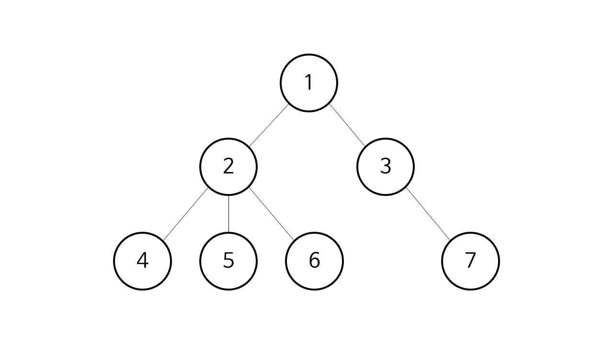

# 0303. algorithm

> 큐
>
> 우선순위 큐
>
> bfs

## 큐 Queue

- 특성
  - 스택과 마찬가지로 삽입과 삭제의 위치가 제한적인 자료구조
  - 선입선출구조 (FIFO : First In First Out)
  - 머리(Front), 꼬리(Rear)
- 연산
  - 삽입 : enQueue (Rear 다음에)
  - 삭제 : deQueue (Front 원소를 반환 후, 삭제)
  - 생성 : createQueue
  - 공백 상태 : isEmpty
  - 포화 상태 : isFull
  - 반환 : Qpeek (Front 원소를 삭제 없이 반환)

- 원형 큐
  - 연산의 효율을 위한 큐
  - 물리적인 개념이 아닌 논리적인 개념
- 원형 큐 구현

```python
class Queue:
    def __init__(self, qmax):
        self.__qmax = qmax
        self.__rear = 0
        self.__front = 0
        self.__arr = [None for _ in range(qmax)]
        self.__length = 0

    def isEmpty(self):
        return self.__length == 0

    def isFull(self):
        return self.__length == self.__qmax

    def enQueue(self, num):
        if self.isFull():
            raise IndexError
        else:
            self.__rear = (self.__rear + 1) % self.__qmax
            self.__arr[self.__rear] = num
            self.__length += 1

    def deQueue(self):
        if not self.isEmpty():
            self.__length -= 1
            self.__front = (self.__front + 1) % self.__qmax
            return self.__arr[self.__front]
        else:
            return

    def __len__(self):
        return self.__length

    def __repr__(self):
        if self.__rear > self.__front:
            return self.__arr[self.__front+1:self.__rear+1]
        elif self.__length:
            tmp1 = self.__arr[self.__front+1:self.__qmax]
            tmp2 = self.__arr[:self.__rear+1]
            return tmp1+tmp2
        else:
            return []

    def __str__(self):
        return str(self.__repr__())
```


## 연결 큐의 구조

- 단순 연결 리스트를 이용한 큐
  - 큐의 원소 : 단순 연결 리스트의 노드
  - 큐의 원소 순서 : 노드의 연결 순서, 링크로 연결되어 있음
  - front : 첫 번째 노드를 가리키는 링크
  - rear : 마지막 노드를 가리키는 링크


## 큐의 활용

### 버퍼

- 데이터를 한 곳에서 다른 한 곳으로 전송하는 동안 일시적으로 그 데이터를 보관하는 메모리의 영역
- 버퍼링


- 버퍼의 자료 구조
  - 버퍼는 일반적으로 입출력 및 네트워크와 관련된 기능에서 이용된다.
  - 순서대로 입력/출력/전달되어야 하므로 FIFO 방식의 자료구조인 큐가 활용된다.


## BFS

> 너비 우선 탐색



- DFS, 깊이 우선 탐색
  - 1 -> 2 -> 4 -> 5 -> 6 -> 3 -> 7
- BFS, 너비 우선 탐색
  - 1 -> 2 -> 3 -> 4 -> 5 -> 6 -> 7