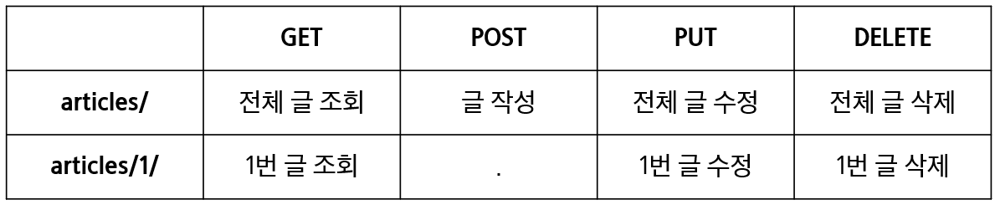

[toc]

---

# DRF - single model

> 요청 및 테스트는 [POSTMAN](https://www.postman.com/downloads/)을 사용합니다.
>
> https://www.django-rest-framework.org/

<br>

## 프로젝트 준비

```bash
$ python -m venv venv
$ source venv/Scripts/activate

$ pip install django django-seed djangorestframework django-extensions ipython
$ pip freeze > requirements.txt

$ django-admin startproject my_api . 
$ python manage.py startapp articles
```

```python
# settings.py

INSTALLED_APPS = [
    'articles',
    'django_seed',
    'django_extensions',
    'rest_framework',
    ...,
]
```

```python
# my_api/urls.py

from django.urls import path, include


urlpatterns = [
    path('admin/', admin.site.urls),
    path('api/v1/', include('articles.urls')),
]
```

```python
# articles/urls.py

from django.urls import path
from . import views


urlpatterns = [

]
```

```python
# articles/models.py

class Article(models.Model):
    title = models.CharField(max_length=10)
    content = models.TextField()
    created_at = models.DateTimeField(auto_now_add=True)
    updated_at = models.DateTimeField(auto_now=True)
```

```bash
$ python manage.py makemigrations
$ python manage.py migrate

$ python manage.py seed articles --number=20
```

<br>

---

<br>

## Model Serializer

> 모델 필드에 해당하는 필드가 있는 Serializer 클래스를 자동으로 만들 수 있는 shorcut을 제공

1. Model 정보에 맞춰 자동으로 필드를 생성
2. serializer에 대한 유효성 검사기를 자동으로 생성
3. .create() 및 .update()의 간단한 기본 구현이 포함됨

<br>

```python
# articles/serializers.py

from rest_framework import serializers
from .models import Article


class ArticleListSerializer(serializers.ModelSerializer):

    class Meta:
        model = Article
        fields = ('id', 'title',)
```

<br>

---

<br>

## Build RESTful API - Article



<br>

### GET - List 

- `api_view` 데코레이터 설정 필수
- id, title 필드만 시리얼라이징 된 결과를 확인

```python
# articles/urls.py

urlpatterns = [
    path('articles/', views.article_list),
]
```

```python
# articles/views.py

from rest_framework.response import Response
from rest_framework.decorators import api_view

from django.shortcuts import render, get_list_or_404

from .models import Article
from .serializers import ArticleListSerializer


@api_view(['GET'])
def article_list(request):
    articles = get_list_or_404(Article)
    serializer = ArticleListSerializer(articles, many=True) 
    return Response(serializer.data)
```

<br>

**Serializing multiple objects**

- 단일 객체 인스턴스 대신 쿼리셋 또는 객체 목록을 시리얼라이징하려면 serializer를 인스턴스화 할 때 `many=True` 를 전달해야 함

```python
MySerializer(queryset, many=True)
```

<br>

### GET - Detail 

- List와 Detail을 구분하기 위해 추가적인 Serializer를 정의

```python
# articles/serializers.py

class ArticleSerializer(serializers.ModelSerializer):

    class Meta:
        model = Article
        fields = '__all__'
```

```python
# articles/urls.py

urlpatterns = [
	 ...,
   path('articles/<int:article_pk>/', views.article_detail),
]
```

```python
# articles/views.py

from django.shortcuts import get_object_or_404
from .serializers import ArticleListSerializer, ArticleSerializer


@api_view(['GET'])
def article_detail(request, article_pk):
    article = get_object_or_404(Article, pk=article_pk)
    serializer = ArticleSerializer(article)
    return Response(serializer.data)
```

<br>

---

<br>

### POST

- `201 Created` 상태 코드 및 메시지 응답
- RESTful 구조에 맞게 작성
  1. URI는 자원을 표현
  2. 자원 대한 조작 행위는 HTTP Method

```python
# articles/views.py

from rest_framework import status


@api_view(['GET', 'POST'])
def article_list(request):
    if request.method == 'GET':
        articles = get_list_or_404(Article)
        serializer = ArticleListSerializer(articles, many=True) 
        return Response(serializer.data)
    
    elif request.method == 'POST':
        serializer = ArticleSerializer(data=request.data)
        if serializer.is_valid():
            serializer.save()
            return Response(serializer.data, status=status.HTTP_201_CREATED)
        return Response(serializer.errors, status=status.HTTP_400_BAD_REQUEST)
```

<br>

**Raising an exception on invalid data**

> https://www.django-rest-framework.org/api-guide/serializers/#validation

- `.is_valid()`는 유효성 검사 오류가 있는 경우 `serializers.ValidationError` 예외를 발생시키는 선택적 `raise_exception` 인자를 사용할 수 있음
- DRF에서 제공하는 기본 예외 처리기에 의해 자동으로 처리되며 기본적으로 HTTP 400 응답을 반환

```python
# articles/views.py

@api_view(['GET', 'POST'])
def article_list(request):
    if request.method == 'GET':
        articles = get_list_or_404(Article)
        serializer = ArticleListSerializer(articles, many=True) 
        return Response(serializer.data)
    
    elif request.method == 'POST':
        serializer = ArticleSerializer(data=request.data)
        # Return a 400 response if the data was invalid.
        if serializer.is_valid(raise_exception=True):
            serializer.save()
            return Response(serializer.data, status=status.HTTP_201_CREATED)
```

<br>

### DELETE

- `204 No Content` 상태 코드 및 메시지 응답

```python
# articles/views.py

@api_view(['GET', 'DELETE'])
def article_detail(request, article_pk):
    article = get_object_or_404(Article, pk=article_pk)
    
    if request.method == 'GET':
        serializer = ArticleSerializer(article)
        return Response(serializer.data)

    elif request.method == 'DELETE':
        article.delete()
        data = {
            'delete': f'데이터 {article_pk}번이 삭제되었습니다.'
        }
        return Response(data, status=status.HTTP_204_NO_CONTENT)
```

<br>

### PUT

```python
# articles/views.py

@api_view(['GET', 'DELETE', 'PUT'])
def article_detail(request, article_pk):
    ...

    elif request.method == 'PUT':
        serializer = ArticleSerializer(article, data=request.data)
        # serializer = ArticleSerializer(instance=article, data=request.data)
        if serializer.is_valid(raise_exception=True):
            serializer.save()
            return Response(serializer.data)
```

