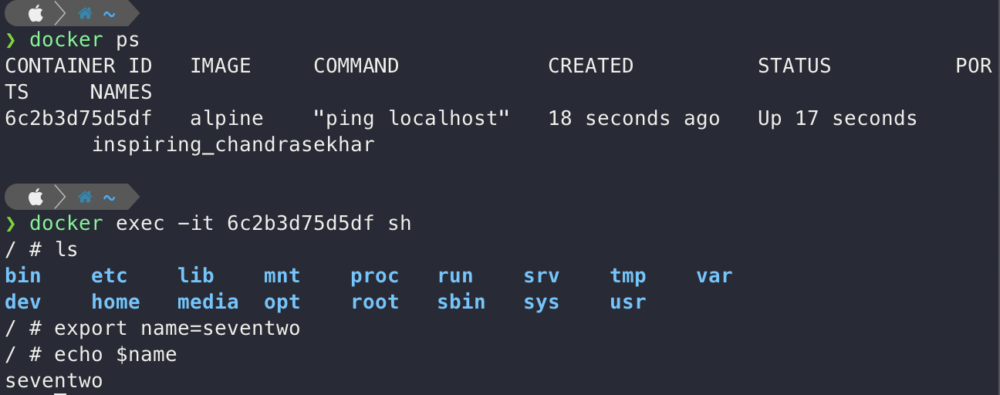

# Docker Client 명령어 알아보기

## docker run <이미지> ls

- docker : docker client 언급
- run : 컨테이너 생성 및 실행
- 이미지 : 컨테이너를 위한 이미지
- ls / command? : 이 자리는 원래 이미지가 가지고 있는 시작 명령어를 무시하고 이 위치 커맨드를 실행하게 한다.
  - ls 커맨드는 현재 디렉토리의 파일 리스트 표출
  - ls 를 실행할 수 있는 파일이 있어야 한다.

<br>

---

<br>

## 컨테이너들 나열하기

### 현재 실행중인 컨테이너 나열

```bash
$ docker ps
```

- CONTAINER ID
- IMAGE
- COMMAND : 컨테이너가 시작될 때 어떠한 커맨드가 실행되었는지
- CREATED
- STATUS
  - Up
  - Exited
  - Pause
- PORTS
- NAMES : 컨테이너의 고유한 이름
  - 컨테이너 생성시 `--name` 옵션으로 이름을 설정할 수 있다.

- 원하는 옵션만 보기
  - ex) `docker ps --format 'table{{.Names}}\table{{.Image}}'`

<br>

### 모든 컨테이너 나열

```bash
$ docker ps -a
```

<br>

---

<br>

## 도커 컨테이너 생명주기

> 생성 > 시작 > 실행 > 중지 > 삭제

- 생성

  ```bash
  $ docker create <이미지 이름>
  ```

- 시작

  ```bash
  $ docker start <시작할 컨테이너 아이디/이름>
  ```

  - `-a` : attach

- 생성 and 시작

  ```bash
  $ docker run <이미지 이름>
  ```

- 중지

  ```bash
  $ docker stop <중지할 컨테이너 아이디/이름>
  ```

  ```bash
  $ docker kill <중지할 컨테이너 아이디/이름>
  ```

  - stop : **GraceFully** 하게 중지를 시킨다. (하던 작업들을 완료하고 중지)
  - kill : 그냥 바로 중지

- 삭제

  ```bash
  $ docker rm <삭제할 컨테이너 아이디/이름>
  ```

  - 모든 컨테이너 삭제

  ```bash
  $ docker rm -a -q
  ```

  - 이미지 삭제

  ```bash
  $ docker rmi <삭제할 이미지 아이디>
  ```

  - 한번에 컨테이너, 이미지, 네트워크 모두 삭제
    - 도커를 쓰지 않을 때 모두 정리하고 싶다면 사용해주는게 좋다.
    - 실행중인 컨테이너에는 영향을 주지 않는다.

  ```bash
  $ docker system prune
  ```

<br>

---

<br>

## 실행 중인 컨테이너에 명령어 전달

```bash
$ docker exec <컨테이너 아이디>
```

- `run` vs `exec`

  - run : 새로 컨테이너를 만들어서 실행
  - exec : 이미 실행중인 컨테이너에 명령어를 전달

- `exec`

  - `it` 실행중인 컨테이너에 계속해서 명령을 할 수 있다.
    - interactive terminal????
    - redis 정리 참고..
  - `sh` 명령어를 사용하여 container 안의 쉘 환경으로 접근할 수 있다.

  

