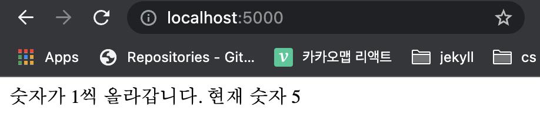

# Docker Compose

Docker compose는 다중 컨테이너 도커 어플리케이션을 정의하고 실행하기 위한 도구, 컨테이너간 네트워크 연결을 쉽게 해준다.

<br>

## Redis를 이용한 node app 만들기

> 서버에 접근할 시 redis 서버에 저장되어있는 변수가 1씩 증가하는 app을 만들어보자.

1. init

   ```bash
   $ npm init
   ```

2. package.json

   - `redis` 와 `express` 를 dependencies에 추가한다.

   ```json
   // package.json
   {
     "dependencies": {
       "express": "4.17.1",
       "redis": "3.1.2"
     }
   }
   ```

   - server를 시작하기 위한 script를 추가한다.

   ```json
   // package.json
   {
     "dependencies": {
       "express": "4.17.1",
       "redis": "3.1.2"
     },
     "scripts": {
       "start": "node index.js"
     }
   }
   ```

3. `index.js` 작성 (이게 중요한게 아닙니다..)

   ```javascript
   // index.js
   const express = require('express');
   const redis = require('redis');
   
   const PORT = 8080;
   
   // redis client
   const client = redis.createClient({
     host: 'redis-server',
     port: 6379
   })
   
   const app = express();
   client.set('number', 0);
   
   app.get('/', (req, res) => {
     client.get('number', (err, number) => {
       client.set('number', +number + 1);
       res.send(`숫자가 1씩 증가합니다. 현재 숫자 : ${+number + 1}`);
     });
   })
   
   app.listen(PORT);
   
   console.log(`Server is running`);
   ```

4. Dockerfile 작성

   ```dockerfile
   FROM node:10
   
   WORKDIR /usr/src/app
   
   COPY ./ ./
   
   RUN npm install
   
   CMD ["npm", "run", "start"]
   ```

<br>

### Redis server와 app 컨테이너를 위한 Docker compose

- `docker-compose.yml`

  ```yaml
  version: "3"
  services:
  	redis-server:
  		image: "redis"
  	node-app:
  		build: .
  		ports:
  			- "5000:8080"
  ```

  - redis-server는 `redis` 이미지를 사용한다.
  - node-app은 `docker-compose.yml` 이 있는 디렉토리 내에 존재하는 `dockerfile`를 통해 build한다.
  - node-app의 port(8080)와 local의 port(5000)을 연결한다.

<br>

### 결과

```bash
$ docker-compose up
```

- `-d` 옵션을 주어서 container를 바로 빠져나올 수 있다. (detach)
- `--build` 옵션을 주어서 이미지가 존재하든 안하든간에 무조건 build하게 할 수 있다.

<br>



