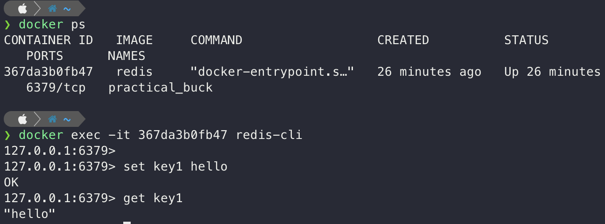

# Redis를 이용한 컨테이너 이해

1. 레디스 서버를 작동 시키자

   ```bash
   $ docker run redis
   ```

2. Redis Client를 켜야 하므로 새로운 터미널을 열고 작동시켜본다.

   ```bash
   $ redis-cli
   ```

   - 에러가 난다..?!
   - Redis Client를 컨테이너 밖에서 실행하려고 하니 당연히 에러가 발생한다.

   

3. `exec` 명령어를 사용하기 위해 `ps` 를 사용하여 id를 알아오자

4. `exec` 을 써보자!

   ```bash
   $ docker exec -it <container id> redis-cli
   ```

   - `it` 옵션을 넣어주어야 이후 명령어를 계속해서 작성할 수 있다.

   

