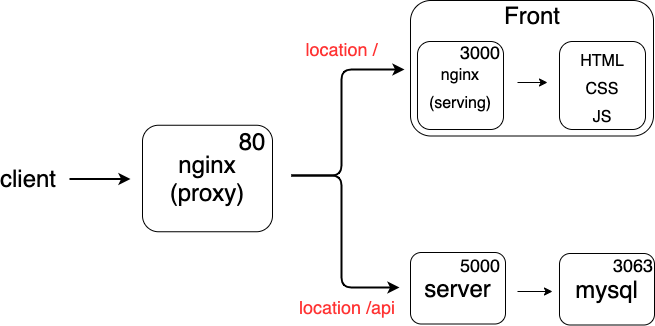

# 멀티 컨테이너 어플리케이션 만들기 (개발 환경)

> frontend
>
> backend
>
> DB

## 프로젝트 구조



<br>

---

<br>

## DB

- 개발 환경 : **Docker**
- 운영 환경 : **AWS RDS**
  - 안정적인 AWS의 RDS 사용

<br>

### Mysql Dockerfile

1. mysql base image

   ```dockerfile
   FROM mysql:5.7
   ```

2. database, table 생성

   ```mysql
   # initialize.sql
   DROP DATABASE IF EXISTS myapp;
   
   CREATE DATABASE myapp;
   USE myapp;
   
   CREATE TABLE lists (
   	id INTEGER AUTO_INCREMENT,
     value TEXT,
     PRIMARY KEY (id)
   );
   ```

3. 한글 깨짐을 방지하기 위한 conf 파일 생성 (my.cnf)

   ```
   [mysqld]
   character-set-server=utf8
   
   [mysql]
   default-character-set=utf8
   
   [client]
   default-character-set=utf8
   ```

4. dockerfile에 `ADD` (my.cnf 추가)

   ```dockerfile
   FROM mysql:5.7
   
   ADD ./my.cnf /etc/mysql/conf.d/my.cnf
   ```

<br>

---

<br>

## nginx(proxy)

1. conf 파일 생성 (`default.conf`)

```
upstream frontend {
    server frontend:3000;
}

upstream backend {
    server backend:5000;
}

server {
    listen: 80;

    location / {
        proxy_pass: http://frontend;
    }

    location /api {
        proxy_pass: http://backend;
    }

    location /sockjs-node {
        proxy_pass: http://frontend;
        proxy_http_version 1.1;
        proxy_set_header Upgrade $http_upgrade;
        proxy_set_header Connection "Upgrade";
    }
}
```

- frontend가 3000번 port에서 돌아가고 있다는 것을 명시해줌
- backend가 5000번 port에서 돌아가고 있다는 것을 명시해줌
- nginx 서버 port 80번으로 열어준다.
- `'/'`는 우선순위가 가장 낮아 `'/api'` 가 아니라면 frontend로 proxy pass!
- `'/api'`로 오는 것은 backend로 proxy pass
- `/sockjs-node`는 개발환경에서 react의 오류를 방지하기 위해 설정한다.

2. `dockerfile` 작성

   ```dockerfile
   FROM nginx
   COPY ./default.conf /etc/nginx/conf.d/default.conf
   ```

<br>

---

<br>

## Docker Compose 작성

```yaml
version: "3"
services:
  frontend:
    build:
      dockerfile: dockerfile.dev
      context: ./frontend
    volumes:
      - /usr/app/node_modules
      - ./frontend:/usr/app
    stdin_open: true
  nginx:
    restart: always
    build:
      dockerfile: dockerfile
      context: ./nginx
    ports:
      - "3000:80"
  backend:
    build:
      dockerfile: dockerfile.dev
      context: ./backend
    container_name: app_backend
    volumes:
      - /usr/app/node_modules
      - ./backend:/usr/app
  mysql:
    build: ./mysql
    restart: unless-stopped
    container_name: app_mysql
    ports:
      - "3306:3306"
    volumes:
      - ./mysql/mysql_data:/var/lib/mysql
      - ./mysql/sqls:/docker_entrypoint-initdb.d/
    environment:
      MYSQL_ROOT_PASSWORD: <비밀번호>
      MYSQL_DATABASE: myapp
```

- `frontend`
  - `dockerfile.dev` 파일명 명시
  - `stdin_open` : 리액트 앱의 오류를 방지하기 위함
- `nginx`
  - `restart` : **always** (항상 재시작합니다.)
    - nginx는 죽으면 안되는 중요한 server이므로 항상 재시작한다.
    - 다른 옵션 : **no, on-failure, unless-stopped**
  - `ports` 포트 맵핑
- `mysql`
  - `environment` : 환경 변수와 값
  - `volumes` : 컨테이너가 삭제되더라도 local에 있는 데이터를 참조하여 데이터의 영속성을 지킨다. **매우 중요**
    - 두번째 volumes 옵션은 최초로 컨테이너가 생성될 때 sql을 통해 db를 초기화하기 위한 것

