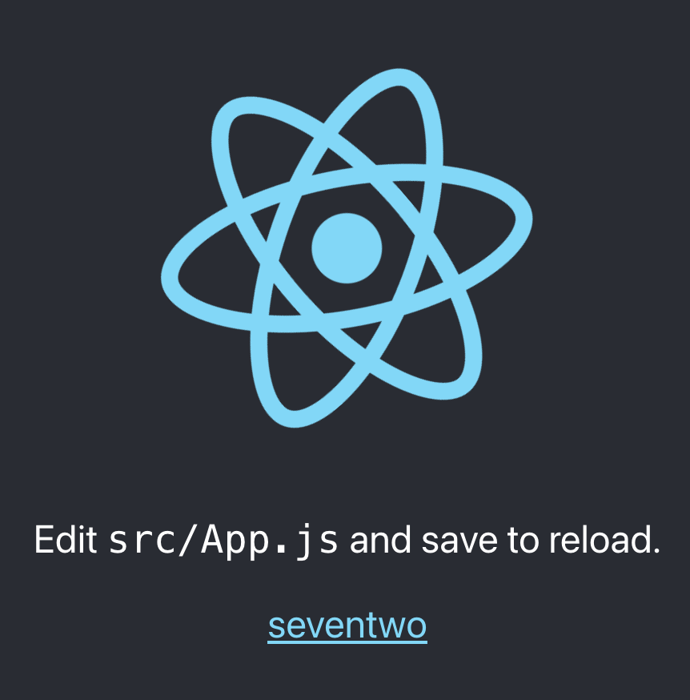

# 단일 컨테이너 어플리케이션 만들기(개발 환경)

> 간단한 리액트 앱을 만들고 배포까지

## CRA(create-react-app)

- directory를 생성하고 CRA를 실행한다.

```bash
$ npx create-react app .
```

<br>

---

<br>

## 개발환경의 dockerfile

- `dockerfile.dev` 를 생성한다.

  ```dockerfile
  FROM node:alpine
  
  WORKDIR /usr/src/app
  
  COPY package.json ./
  
  RUN npm install
  
  COPY ./ ./
  
  CMD ["npm", "run", "start"]
  ```

- 개발환경에서 이미지를 빌드할 때 임의로 dockerfile를 명시해줘야 한다.

  ```bash
  $ docker build -f dockerfile.dev . -t <이미지 이름>
  ```

- local 환경에 `node_modules`가 존재한다면 오히려 build 시간이 오래걸린다..

  - `COPY ./ ./` 때문에
  - `node_modules`를 지우고 하자~

<br>

### 개발환경의 docker container 실행

```bash
$ docker run -it -p 5000:3000 <이미지 이름>
```

<br>

---

<br>

## Volume

개발할 때 하나하나 바뀔때마다 build하는 것은 비효율적인 일 `Volume` 을 이용해보자.

```bash
$ docker run -it -p 5000:3000 -v /usr/src/app/node_modules -v $(pwd):/usr/src/app <이미지 이름>
```

이제 소스 코드를 변경하더라도 이미지를 빌드하지 않아도 코드 변경된 점이 반영되는 것을 확인할 수 있다.



<br>

---

<br>

## docker-compose로 간단하게 app 실행하기

`Volume` 옵션까지 주어서 run을 하자니 너무나 긴 명령어가 형성되는 것을 확인할 수 있다.

`docker-compose.yml`를 만들어서 좀 더 간단하게 앱을 실행해보자.

```yaml
version: "3"
services:
	react:
		build:
			context: .
			dockerfile: dockerfile.dev
		ports:
			- "5000:3000"
		volumes:
			- /usr/src/app/node_modules
			- ./:/usr/src/app
		stdin_open: true
```

- `context` : 도커 이미지를 구성하기 위한 파일과 폴더들이 있는 위치
- `dockerfile` : dockerfile의 이름을 명시해준다.
- `volumes` : 파일 맵핑
  - node_modules는 맵핑하지 않는다.
- `stdin_open` : 리액트 앱을 끌 때 필요 (버그 수정)

<br>

---

<br>

## react-app test

- `run`을 통해 test하기

  ```bash
  $ docker run -it <이미지 이름> npm run test
  ```

- docker compose yaml에 test container 만들기

  ```yaml
  services: 
  	...
  	tests:
  		build:
  			context: .
  			dockerfile: dockerfile.dev
  		volumes:
  			- /usr/src/app/node_modules
  			- ./:/usr/src/app
  		command:
  			["npm", "run", "test"]
  ```

  