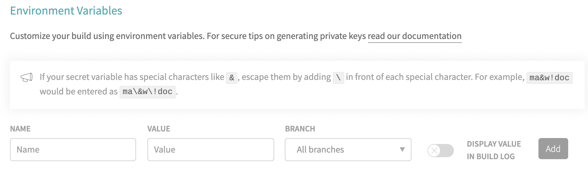

# 단일 컨테이너 어플리케이션 만들기(운영 환경)

<br>

## Dockerfile

1. builder 단계 : 이곳의 목표는 빌드 파일들을 생성하는 것

   ```dockerfile
   FROM node:alpine as builder
   WORKDIR /usr/src/app
   COPY package.json ./
   RUN npm install
   COPY ./ ./
   RUN npm run build
   ```

2. nginx

   ```dockerfile
   ...
   FROM nginx
   COPY --from=builder /usr/src/app/build /usr/share/nginx/html
   ```

   - `/usr/share/nginx/html` 에 두어야 nginx가 알아서 요청이 들어올 때 알맞은 정적 파일들을 제공해준다.

<br>

### build

```bash
$ docker build .
```

<br>

### run

```bash
$ docker run -p 8080:80 <이미지 이름>
```

- nginx의 port는 80번

<br>

---

<br>

## Travis CI

Travis CI는 오픈소스 프로젝트를 위한 **지속적인 통합 (Continuous Integration)** 서비스 이다.

우선, [공식 사이트](https://www.travis-ci.com/)에 들어가서 github로 로그인 후 몇가지 세팅을 진행한다.. 어려운 내용은 아니니 추가하지 않겠습니다..

<br>

### .travis.yml

```yaml
sudo: required

language: generic

services:
	- docker
	
before_install:
	- echo "start Creating an image with dockerfile"
	- docker build -t jyong9591/docker-react-app -f dockerfile.dev .
	
script:
	- docker run -e CI=true jyong9591/docker-react-app npm run test -- --coverage
	
after_success:
	- echo "test success"
```

- `sudo` : 관리자 권한 갖기
- `language` : 언어 (플랫폼) 설정
- `services` : docker 환경 구성
- `before_install` : 스크립트를 실행할 수 있는 환경 구성
- `script` : 실행할 스크립트 (테스트)
  - `-e CI=true` : travis ci에서 이 부분이 존재하지 않으면 에러가 난다.
  - `npm run test` : 컨테이너 생성 후 test
  - `-- --coverage` : 테스트 한 것을 좀 더 명확하게 보여준다.
- `after_success` : 테스트 성공 후 할 일 (aws로 보내주는 일 등..)

<br>

---

<br>

## 배포하기

> AWS EC2, Elastic Beanstalk

1. AWS Elastic Beanstalk 환경 생성

2. `.travis.yml` 수정

   ```yaml
   sudo: required
   
   language: generic
   
   services:
   	- docker
   	
   before_install:
   	- echo "start Creating an image with dockerfile"
   	- docker build -t jyong9591/docker-react-app -f dockerfile.dev .
   	
   script:
   	- docker run -e CI=true jyong9591/docker-react-app npm run test -- --coverage
   	
   deploy:
   	provider: elasticbeanstalk
   	region: "ap-northeast-2"
   	app: "docker-react-app"
   	env: "Dockerreactapp-env"
   	bucket_name: "..."
   	bucket_path: "docker-react-app"
   	on:
   		branch: master
   ```

   - `provider` : 외부 서비스에 대한 표시 (elasticbeanstalk, s3 등..)
   - `region` : aws의 서비스가 위치하고 있는 물리적인 장소
   - `app` : 생성된 어플리케이션 이름
   - `env` : 환경 이름
   - `bucket_name` : travis ci에서 가지고 있는 파일을 압축해서 S3에 보내기 때문에 bucket name을 설정해야한다.
     - elasticbeanstalk 환경을 구성하면 s3를 자동으로 생성한다.
   - `bucket_path` : app 이름과 동일하다.
   - `on`
     - `branch` : 어떤 branch에 push를 할 때 배포할 것인지

<br>

### AWS접근을 위한 API 생성

> AWS IAM

root 사용자를 사용하는 것을 보안상 옳지 않은 방법이다.

`IAM` 을 통해서 `Elastic Beanstalk`에 대한 접근 권한이 있는 사용자를 추가하여 access key를 발급받아 `.travis.yml` 파일에 등록한다.

access key는 github 등의 repository에 공개되면 안되는 중요한 정보이므로 travis ci settings로 이동하여 변수를 등록하여 사용한다 !



- `.travis.yml`

  ```yaml
  sudo: required
  
  language: generic
  
  services:
  	- docker
  	
  before_install:
  	- echo "start Creating an image with dockerfile"
  	- docker build -t jyong9591/docker-react-app -f dockerfile.dev .
  	
  script:
  	- docker run -e CI=true jyong9591/docker-react-app npm run test -- --coverage
  	
  deploy:
  	provider: elasticbeanstalk
  	region: "ap-northeast-2"
  	app: "docker-react-app"
  	env: "Dockerreactapp-env"
  	bucket_name: "..."
  	bucket_path: "docker-react-app"
  	on:
  		branch: master
  	access_key_id: $AWS_ACCESS_KEY
  	secret_access_key: $AWS_SECRET_ACCESS_KEY
  ```

- nginx port mapping

  ```dockerfile
  ...
  FROM nginx
  EXPOSE 80
  COPY --from=builder /usr/src/app/build /usr/share/nginx/html
  ```

  