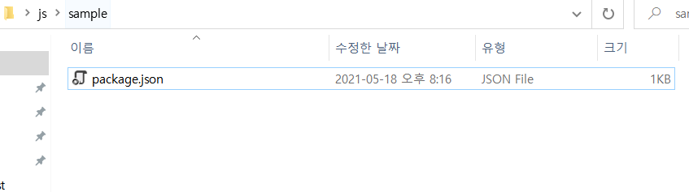
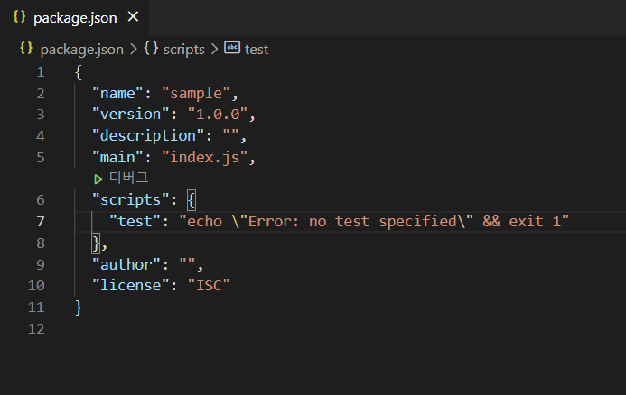
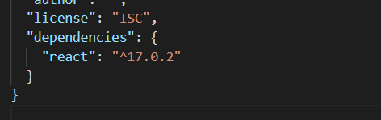

# [Frontend] NPM

Node.js란 자바스크립트를 브라우저가 아닌 환경에서도 구동할 수 있도록하는 **자바스크립트 런타임 환경**이다.

<br>

## 1. Node.js가 필요한 이유

- **최신 스펙으로 개발할 수 있다.**
  - 빠르게 진화하는 자바스크립트에 비해 브라우저의 지원 속도는 항상 뒤쳐진다. 아무리 편리한 기능이 추가되더라도 이를 사용할 수 있게 해주는 도구가 존재하지 않는다면 사용이 어려울 수 있다.
- **빌드 자동화**
  - 코딩의 결과물을 바로 배포하는 경우는 흔치 않다. 파일 압축, 코드 난독화, 폴리필 추가 등 개발 이외의 작업을 거친 후 배포한다. **Node.js**는 이러한 일련의 빌드 과정을 이해하는데 도움을 준다.
- **개발 환경 커스터마이징**
  - react나 Vue.js를 사용하게 되면 기본적으로 개발 도구를 제공하기 때문에 개발을 쉽게 시작할 수 있다. 하지만 각 프로젝트마다 형편이 있어 특별한 경우 제공하는 툴을 그대로 사용할 수 없는 경우가 생길 수 있다. 이러한 문제를 해결하기 위해 **개발 환경을 커스터마이징**해야 하는데 이는 **Node.js**지식이 필요하다.

<br>

## 2. 프로젝트 생성

> npm 패키지를 생성한다.

- package 생성

```bash
$ npm init
```

author, git repository, package name 등을 입력할 수 있는데 그냥 넘어갔다. 모든 질문을 스킵하려면 `npm init -y` 명령어를 통해 스킵할 수 있다.

그럼 `package.json` 이 생성되어 있는 것을 볼 수 있다.



이제 `package.json`을 들어가서 확인해보자.



- `name` : 프로젝트 이름
- `version` : 프로젝트 버전 정보
- `description` : 프로젝트 설명
- `main` : 노드 어플리케이션일 경우 진입점 경로, 프론트엔드 프로젝트에서는 사용하지 않는다.
- `scripts` : 프로젝트 명령어를 등록하는 곳
- `author` : 말 그대로 작성자
- `license` : 라이센스

<br>

## 3. 패키지 설치

### 3.1 CDN

> Contents Delivery Network

외부 라이브러리를 사용하는 가장 간단한 방법은 CDN으로 라이브러리를 직접 가져오는 방식이다.

```html
<script src="...."></script>
```

만약 CDN 서버의 장애로 인해 해당 라이브러리를 가져올 수 없다면 우리가 만든 어플리케이션 서버가 정상적이더라도 정상적으로 작동하지 않을 것이다.

<br>

### 3.2 직접 다운로드

라이브러리 코드를 직접 다운로드 받아 우리가 만든 프로젝트에 넣는 것도 방법 중 하나이다.

하지만 라이브러리는 계속해서 업데이트 될 것이고, 그에따라 우리의 프로젝트도 교체를 해주어야 한다. 매번 다운로드 받는 것은 매우 귀찮은 일이고, 버전에 따라 하위 호환성 여부까지 확인하려면 실수할 여지가 많다.

<br>

### 3.3 NPM

NPM은 라이브러리를 어느 곳에서 업데이트하고 하위 호환되는 안전한 버전만 다운받아 사용할 수 있게 패키지를 관리한다. `npm install` 명령어로 외부 패키지를 다운로드 할 수 있다.

리액트를 다운로드 해보자.

```bash
$ npm install react
```

`package.json`에 설치한 패키지 정보가 기록된 것을 확인할 수 있다.



버전 17.0.2를 설치했다는 의미이다.

<br>

### 3.4 유의적 버전

Node.js가 버전을 관리하는 방식에 대해 알아보자.

버전 번호를 관리하기 위한 규칙이 필요한데 이 체계를 **유의적 버전** 이라고 한다.

유의적 버전은 주(Major), 부(Minor), 수(Patch) 세 가지 숫자를 조합해서 버전을 관리한다. 따라서 위에서 다운로드한 react는 주버전이 17, 부 버전이 0 그리고 수 버전이 2인 셈이다.

- 버전 변경의 기준
  - 주 버전(Major Version) : 기존 버전과 호환되지 않게 변경한 경우
  - 부 버전(Minor Version) : 기존 버전과 호환이 되면서 기능이 추가된 경우
  - 수 버전(Patch Version) : 기존 버전과 호환이 되면서 버그를 수정한 경우

<br>

### 3.5 버전의 범위

- 가장 단순하게 특정 버전을 사용하는 경우

```bash
1.2.3
```

- 특정 버전보다 높거나 낮을 경우

```bash
>1.2.3
>=1.2.3
<1.2.3
<=1.2.3
```

- **틸트(~) 와 캐럿(^)을 이용해 범위를 명시한다.

```bash
~1.2.3
^1.2.3
```

- `틸트(~)` 
  - 마이너 버전이 명시되어 있으면 **패치버전만 변경한다.**
  - 마이너 버전이 없으면 **마이너 버전을 갱신한다.**
  - ~0 => 0.0.0부터 1.0.0 미만
- `캐럿(^)`
  - **정식버전에서 마이너와 패치 버전을 변경한다.**
  - 정식버전 미만인 0.x 버전은 **패치만 갱신한다.**
  - ^0 => 0.0.0부터 0.1.0 미만

