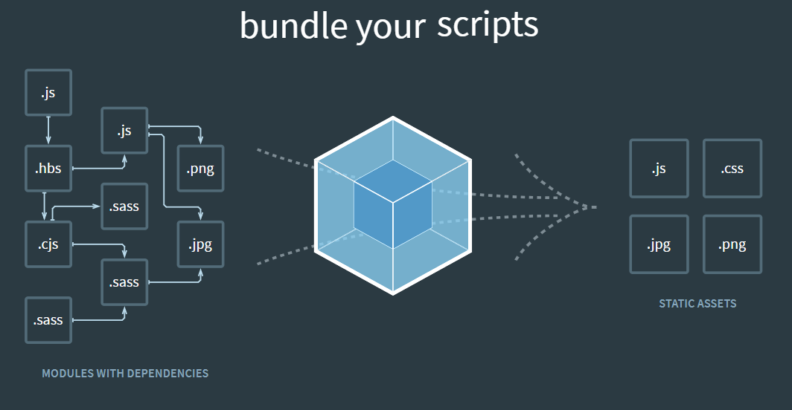
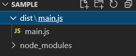

# [Frontend] webpack



[출처](https://webpack.js.org/)

<br>

## 0. 배경

자바스크립트와 어플리케이션이 복잡해지고 크기가 커지자 전역 스코프가 오염되는 문제가 발생하게 되었다. (전역 스코프를 공유..) 그래서 코드를 모듈 단위로 작성하는 등의 다양한 시도가 이루어지게 된다.

하지만 모듈의 수가 많아지고 라이브러리 혹은 모듈 간의 **의존성이 깊어지면서** 특정한 곳에서 발생한 문제가 어떤 모듈 간의 문제인지 파악하기도 어려워졌다..(의존성 문제)

webpack이라는 모듈 번들러를 통해 위의 문제를 해결하고 유지, 보수 측면에서도 매우 편리해질 수 있다.

webpack은 module로 연결된 여러개의 파일을 하나로 합친 bundle로 만들어 준다. webpack이 이러한 bundle을 만들어주는 역할을 하므로 bundler라고 한다. (webpack 이외에도 다양한 모듈 번들러가 존재한다.)

이제 이 bundling 작업을 시작해보자.

<br>

## 1. webpack 설치

- webpack과 webpack을 터미널 명령어로 사용할 수 있는 webpack-cli를 설치한다.

```bash
$ npm install -D webpack webpack-cli
```

- `-D` : 개발용 패키지로 설치한다.

<br>

## 2. webpack 사용하기

설치를 완료하게 되면 `node_module/.bin/` 폴더에 실행 가능한 명령어가 몇 가지 생긴다. `--help` 옵션을 통해 사용 방법을 확인해 보자.

```bash
$ node_modules/.bin/webpack --help

 --mode <value>                         Defines the mode to pass to webpack.
 --entry <value...>                     The entry point(s) of your application e.g. ./src/main.js.
 -o, --output-path <value>              Output location of the file generated by webpack e.g. ./dist/.
```

**3가지 옵션을 필수**적으로 넣어주어야 한다.

하나의 시작점(entry point)으로부터 의존적인 모듈을 전부 찾아내서 하나의 결과물을 만들어 낸다.

```bash
$ node_modules/.bin/webpack --mode development --entry ./src/app.js -o dist/main.js
```

- 개발 모드
- `./src/app.js`를 시작으로 의존적인 모듈을 전부 찾아낸다.
- `dist/main.js`로 결과물을 만들어 낸다.



<br>

매번 긴 명령어를 작성할 수 없으니 webpack 설정 파일을 하나 만들어 보자.

- `webpack.config.js` 생성

```javascript
const path = require('path');

module.exports = {
    mode: 'development',
    entry: {
        main: './src/app.js'
    },
    output: {
        path: path.resolve('./dist'),
        filename: '[name].js'
    }
}
```

- entry point의 경로 뿐만 아니라 이름도 적어준다.
- output은 **path와 파일 명 속성을 넣어준다.**
  - path : node의 path 모듈을 가져와 절대 경로를 작성한다.
  - filename : `[name]`로 작성하여 여러개의 번들 이름을 동적으로 작성할 수 있다.

<br>

- `package.json` 에 npm script를 추가해보자.

```javascript
// package.json
{
    ...
    "scripts": {
        "build": "webpack"
    }
}
```

- npm이 현재 프로젝트에 있는 webpack 명령어를 찾아 실행시킨다.

```bash
$ npm run build
```

<br>

## 3. 로더

<br>

### 3.1 로더의 역할

웹팩은 모든 파일을 모듈로 바라본다. 자바스크립트로 만든 모듈 뿐만아니라 css, 이미지, 폰트까지 전부 모듈로 보기 때문에 import 구문을 사용하면 자바스크립트 코드 안으로 가져올 수 있다.

이는 모두 **로더**덕분이다. 로더는 타입스크립트 같은 다른 언어를 자바스크립트 문법으로 변환해 주거나 이미지를 data URL 형식의 문자열로 변환한다. 뿐만아니라 CSS 파일을 자바스크립트에서 직접 로딩할 수 있도록 해준다.

<br>

### 3.2 커스텀 로더 만들기

> 로더의 동작 원리를 이해해보자.

- my-webpack-loader.js

  ```javascript
  module.exports = function myLoader (content) {
      console.log('동작 !');
      return content;
  }
  ```

  - 로더가 동작하는지를 알아보기 위해 console.log만 사용하고 내용은 바로 반환한다.

이제 로더를 사용하기 위해 웹팩 설정 파일(`webpack.config.js`)에 **module**을 추가한다.

- webpack.config.js

  ```javascript
  module.exports = {
     ...
     module = {
         rules: [
             {
                 test: /\.js$/, // .js로 끝나는 모든 파일
                 use: [
                     path: path.resolve('./my-webpack-loader.js') // 로더 적용
                 ]
             }
         ]
     }
  }
  ```


<br>

### 3.3 자주 사용하는 로더

- `css-loader` : css 파일을 javascript 모듈처럼 사용할 수 있게 해주는 로더

  - 로더 설치

    ```bash
    $ npm install -D css-loader
    ```

  - 웹팩 설정에 로더를 추가한다.

    ```javascript
    module.exports = {
      module: {
        rules: [
          {
            test: /\.css$/, // .css 확장자로 끝나는 모든 파일
            use: ["css-loader"], // css-loader를 적용한다
          },
        ],
      },
    }
    ```

  - 이를 브라우저에 적용시키기 위해서는 `style-loader`가 필요하다.

- `style-loader` : 처리된 javascript 문자열 css 코드를 html에 주입시켜 브라우저에 스타일이 적용되게 해주는 로더

  - 로더 설치

    ```bash
    $ npm install -D style-loader
    ```

  - 로더 추가

    ```javascript
    module.exports = {
      module: {
        rules: [
          {
            test: /\.css$/,
            use: ["style-loader", "css-loader"], // style-loader를 앞에 추가한다, 배열의 뒤에서 부터 loader를 실행한다.
          },
        ],
      },
    }
    ```

- `file-loader` : image파일을 모듈로 사용할 수 있게 해주는 로더, 사용할 파일을 output경로로 이동시킨다.

  - 로더 설치

    ```bash
    $ npm install -D file-loader
    ```

  - 로더 추가

    ```javascript
    module.exports = {
      module: {
        rules: [
          {
            test: /\.png$/, // .png 확장자로 마치는 모든 파일
            loader: "file-loader",
            options: {
              publicPath: "./dist/", // prefix를 아웃풋 경로로 지정
              name: "[name].[ext]?[hash]", // 파일명 형식, cashe 무력화를 위해서 매번 달라지는 hash 값을 입력한다.
            },
          },
        ],
      },
    }
    ```

- `url-loader` : 작은 이미지를 여러 개 사용한다면 **Data URI Scheme**을 이용하는 방법이 더 나은 경우도 있다. 파일을 base64로 인코딩해서 javascript 문자열로 변환한다. 처리할 파일의 limit을 둬서 일정 파일의 크기 이하일때만 인코딩을 수행한다.

  - 로더 설치

    ```bash
    $ npm install -D url-loader
    ```

  - 로더 추가

    ```javascript
    {
      test: /\.png$/,
      use: {
        loader: 'url-loader', // url 로더를 설정한다
        options: {
          publicPath: './dist/', // file-loader와 동일
          name: '[name].[ext]?[hash]', // file-loader와 동일
          limit: 20000 // 20kb 미만 파일만 data url로 처리
        }
      }
    }
    ```

    

  

