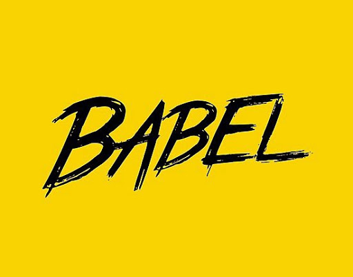

# [Frontend] Babel



<br>

## 0. 배경

<br>

### 0-1 크로스 브라우징

> 웹 브라우저마다 달리 구현되는 기술을 비슷하게 만듦과 동시에 어느 한쪽에 최적화되어 치우치지 않도록 공통 요소를 사용하여 웹 페이지를 제작하는 기법

인터넷이 급속도로 성장할 수 있었던 배경은 웹의 역할이 컸다. 웹의 사용이 늘어나면서 웹 브라우저도 많이 생겨나게 됐는데 이로 인해 파편화라는 치명적인 문제가 생기게 됐다. 브라우저마다 사용하는 언어가 달라서 프론트엔드 코드가 일관적이지 못할 때가 많다. 그래서 **크로스 브라우징**이라는 것이 생겨났다.

크로스 브라우징을 해줄 수 있는 것이 **바벨**이다. ES6+로 작성한 코드를 모든 브라우저에서 동작하도록 호환성을 지켜준다. 타입스크립트, JSX처럼 다른 언어로 분류되는 것도 포함된다.

<br>

### 0-2 트랜스파일과 빌드

호환성을 지켜주도록 변환하는 것을 **트랜스파일**한다고 표현한다. 

<br>

## 1. 바벨의 기본 동작

바벨은 ES6 이상의 코드를 적당한 하위 버전으로 바꾸는 것이 주된 역할이다. 변환이 완료된 코드는 ES6 이상을 지원하지 않는 구 브라우저에서도 잘 작동한다.

- 최신 문법의 자바스크립트 명령 (const 키워드, arrow function)

  ```javascript
  const alert = msg => window.alert(msg);
  ```

<br>

- 바벨 설치, CLI 도구도 함께 설치한다.

  ```bash
  $ npm i -D @babel/core @babel/cli
  ```

- 바벨 명령을 사용한다.

  ```bash
  $ node_modules/.bin/babel app.js
  or
  $ npx babel app.js
  
  const alert = msg => window.alert(msg);
  ```

아무런 변화가 없는 것을 확인할 수 있다.

바벨은 **세 단계**로 빌드를 진행한다.

1. 파싱(Parsing)
2. 변환(Transforming)
3. 출력(Printing)

코드를 읽고 추상 구문 트리(AST)로 변환하는 단계를 **파싱**이라고 한다. 추상 구문 트리를 변경하는 것이 **변환**단계이다. 실제로 코드를 변경하는 작업을 한다. 변경된 결과물을 **출력**하여 바벨은 작업을 완료한다.

<br>

## 2. 플러그인

코드를 변환하기 위해 코드를 받아 이를 통해 변환한다.

바벨은 **파싱**과 **출력**만 담당하고 변환 작업은 **플러그인**이 수행한다.

<br>

### 2.1 커스텀 플러그인

플러그인의 동작 과정을 이해해보기 위해 직접 코드를 작성해보자.

```javascript
// my-plugin.js
module.exports = function myPlugin() {
    return {
        visitor: {
            Identifier(path) {
                const name = path.node.name;
                
                // 바벨이 파싱한 AST 노드를 console.log!
                console.log(name);
                
                path.node.name = 'jiyong'
            }
        }
    }
}
```

<br>

- 명령어를 통해 빌드해보자.

  ```bash
  $ npx babel app.js --plugins ./my-plugin.js
  ```

  ```bash
  alert
  msg
  window
  alert
  msg
  const jiyong = jiyong => jiyong.jiyong(jiyong);
  ```

<br>

- `const` 키워드는 es6 이상에서 지원하는 키워드로 `var`로 변환하기 위해 plugin을 작성해보자.

  ```javascript
  module.exports = function myPlugin() {
      return {
          visitor: {
              VariableDeclaration(path) {
                  if (path.node.kind === 'const') {
                      path.node.kind = 'var'
                  }
              }
          }
      }
  }
  ```

- 위의 플러그인으로 빌드해보자.

  ```bash
  $ npx babel app.js --plugins ./my-plugin.js
  ```

  ```bash
  var alert = msg => window.alert(msg);
  ```

<br>

## 2.2 플러그인 사용하기

실제로는 플러그인을 직접 작성해서 빌드하는 일은 드물다. const, let 처럼 블록 스코프를 따르는 키워드를 함수 스코프를 따르는 var로 변경하는 플러그인을 설치하여 사용해보자.

- 플러그인 설치

  ```bash
  $ npm i -D @babel/plugin-transform-block-scoping
  ```

- 설치한 플러그인 사용

  ```bash
  $ npx babel app.js --plugins @babel/plugin-transform-block-scoping
  ```

  ```bash
  var alert = msg => window.alert(msg);
  ```

<br>

화살표 함수또한 ES6+ 문법이므로 플러그인을 이용해 일반 함수로 변경할 수 있다.

- 플러그인 설치

  ```bash
  $ npm i -D @babel/plugin-transform-arrow-functions
  ```

- 플러그인 사용

  ```bash
  $ npx babel app.js @babel/plugin-transform-arrow-functions
  ```

  ```bash
  const alert = function (msg) {
    return window.alert(msg);
  };
  ```

<br>

`use strict`를 추가하여 엄격 모드를 사용하는 것이 안전하다. 이를 추가하기 위해서는 **strict-mode** 플러그인을 사용해야한다.

플러그인 사용이 많아지므로 이제 설정 파일을 따로 생성하여 plugin을 지정해주는 것이 좋을 것이다.

- 바벨 설정 파일 생성

  ```javascript
  module.exports = {
      plugins: [
          '@babel/plugin-transform-block-scoping',
          '@babel/plugin-transform-arrow-functions',
          '@babel/plugin-transform-strict-mode'
      ]
  }
  ```

- 빌드

  ```bash
  $ npx babel app.js
  ```

  ```bash
  "use strict";
  
  var alert = function (msg) {
    return window.alert(msg);
  };
  ```

  

<br>

## 3. 프리셋

코드 한 줄을 변환하려고 세 개의 플러그인을 세팅했다. 비효율적이다..

목적에 맞게 여러가지 플러그인을 세트로 모아놓은 것을 **프리셋**이라고 한다.

<br>

### 3.1 커스텀 프리셋

앞서 사용한 세 개의 플러그인을 하나의 프리셋으로 만들어 보자.

```javascript
// my-preset.js
module.exports = function myPreset() {
    return {
        plugins: [
            '@babel/plugin-transform-block-scoping',
            '@babel/plugin-transform-arrow-functions',
            '@babel/plugin-transform-strict-mode'
        ]
    }
}
```

<br>

- 프리셋을 사용하기 위해 바벨 설정 파일도 수정한다.

  ```javascript
  module.exports = {
      presets: [
          './my-preset.js'
      ]
  }
  ```

<br>

### 3.2 프리셋 사용하기

바벨은 목적에 따라 몇 가지 프리셋을 제공한다.

- `preset-env`
- `preset-flow`
- `preset-react`
- `preset-typescript`

<br>

preset-env는 ES6+를 변환할 때 사용한다. 그리고 flow, react, typescript를 변환하기 위한 프리셋도 존재한다.

preset-env를 설치하여 빌드하여 보자.

- 패키지 다운로드

  ```bash
  $ npm i -D @babel/preset-env
  ```

- 바벨 설정 수정

  ```javascript
  module.exports = {
      presets: [
          '@babel/preset-env',
      ]
  }
  ```

- 빌드

  ```bash
  $ npx babel app.js
  ```

  ```bash
  "use strict";
  
  var alert = function alert(msg) {
    return window.alert(msg);
  };
  ```

<br>

## 4. env 프리셋 설정과 폴리필

### 4.1 타겟 브라우저

`target`옵션을 추가하여 특정 브라우저와 버전명을 지정하면 env 프리셋은 이에 맞는 플러그인을 찾아 최적의 코드를 출력한다.

```javascript
// babel.config.js
module.exports = {
    presets: [
        [
            '@babel/preset-env',
            {
                targets: {
                    chrome: '79' // 크롬 브라우저의 79버전 까지 지원하는 코드로 변환
                }
            }
        ]
    ]
}
```

- 빌드

  ```bash
  $ npx babel app.js
  ```

  ```bash
  "use strict";
  
  const alert = msg => window.alert(msg);
  ```

<br>

우리의 ~~적~~인 ie도 추가할 수 있다.

```javascript
module.exports = {
    presets: [
        [
            '@babel/preset-env',
            {
                targets: {
                    chrome: '79',
                    ie: '11'
                }
            }
        ]
    ]
}
```

- 빌드

  ```bash
  $ npx babel app.js
  ```

  ```bash
  "use strict";
  
  var alert = function alert(msg) {
    return window.alert(msg);
  };
  ```

<br>

### 4.2 폴리필

ES6의 Promise 객체를 사용하는 코드를 작성해보자.

```javascript
// app.js
new Promise();
```

<br>

이전의 바벨 설정 그대로 빌드를 해보자.

```bash
$ npx babel app.js
```

```bash
"use strict";

new Promise();
```

분명 Promise 객체를 ie에서는 지원하지 않을텐데 변화가 없다.

Promise객체를 대체할 문법은 ES5에서는 존재하지 않는다. 바벨은 ES5 버전으로 변환할 수 있는 것만 빌드한다. 그렇지 못한 것들은 **폴리필**이라 불리는 코드조각을 추가해서 해결한다.

- 바벨 환경에 폴리필을 지정하는 옵션을 추가한다

  ```javascript
  // bable.config.js
  module.exports = {
      presets: [
          [
              "@babel/preset-env",
              {
                  useBuiltIns: 'usage', // 폴리필 사용 방식 지정
                  corejs: {
                      version: 2
                  }
              }
          ]
      ]
  }
  ```

- 결과

  ```bash
  "use strict";
  
  require("core-js/modules/es6.object.to-string.js");
  
  require("core-js/modules/es6.promise.js");
  
  new Promise();
  ```

<br>

## 5. 웹팩과 통합

일반적으로 바벨을 직접 사용하는 것보다는 웹팩과 통합해서 사용한다. **babel-loader** 로더 형태로 제공한다.

- 패키지 설치

  ```bash
  $ npm i -D babel-loader
  ```

- 웹팩 설정에 로더 추가

  ```javascript
  // webpack.config.js
  module.exports = {
      modules: {
          rules: [
              {
                  test: /\.js$/,
                  loader: 'babel-loader',
                  exclude: /node-modules/, // node-modules 폴더를 처리하지 않도록 예외 처리
              }
          ]
      }
  }
  ```

- core-js도 설치해주어야 올바르게 빌드가 된다. (버전 2 설치)

  ```bash
  $ npm i core-js@2
  ```

  