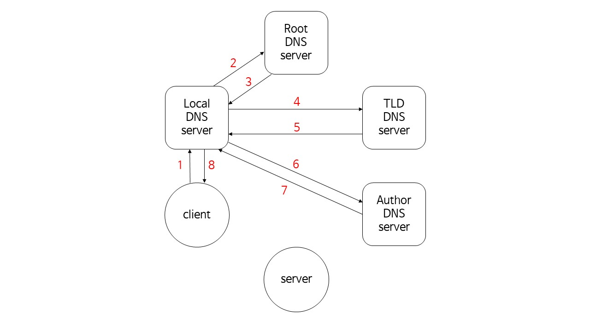

# 네트워크 2강

## Cashing example

- 가정
  - 100 Mbps LAN
  - 15.4 Mbps access link
  - avg object size : 1 M bits
  - avg request rate from browsers to origin servers : 15/sec
  - avg data rate to browsers : 15 Mbps
  - RTT from router A to any origin server : 2sec (internet delay)
- 결과
  - LAN utilization : 15%
  - access link utilization : **99%**
  - total delay = internet delay + access delay + LAN delay = 2 sec + **minutes** + milliseconds
- 해결
  - cable 확장 공사.. 완전 비효율적
  - **web proxy 설치**

## web proxy의 일관성 문제 해결

### Conditional GET

- 조건에 따라서 data를 받겠다!
- client -> server : request msg **`If-modified-since: <date>`**
- server -> client : response msg 304 Not Modified / 200 OK data, data ...

## DNS: domain name system

> 친구들과 전화는 많이 하지만, 전화번호를 일일이 알고 있진 않지!
>
> 전화번호부

- 얘도 application 계층
  - UDP
  - 유실되면 어떻게..
  - DNS에서 오가는 데이터의 크기는 매우 작다.
  - 유실될 확률이 적을 뿐만 아니라, 데미지가 적다.
  - 본질 자체가 본래 데이터를 받기 위한 준비 동작일 뿐.

- 이름 : 전화번호 / NAME : IP address
- 그런데 과연 구현이 간단할까?
  - 어디에다가 데이터를 전부 저장해둘건데..?
  - 검색시간도 감당 안돼..
  - 그렇다고 없어서는 안된다.

### DNS: a distributed, hierarchical database

> 규모가 커지면 분산과 계층화!

- root name servers : 분산해서 전 세계에 13군데
  - TLD, authoritative servers
    - top-level domain (TLD) servers
    - authoritative DNS servers
      - 각 기관이 보유하고 있는 도메인에 속한 이름을 가지고 있는 IP addr를 관리해야한다.
        - www
        - portal

### DNS name resolution example

> client wants IP address for server

- local DNS server는 cache라고 볼 수 있는데, 이 는 일관성 문제를 야기한다.
  - TTL (Time To Live) : 유효기간으로 유효기간이 지나면 다시 IP addr를 가져와야 한다.

### DNS records

> directory의 실제 column의 수는 4개
>
> RR format: (name, value, type, ttl)

- type
  - A
    - name : hostname
    - value : IP address
  - NS
    - name : domain
    - value : host name of authoritative name server for this domain
  - CNAME
  - MX

