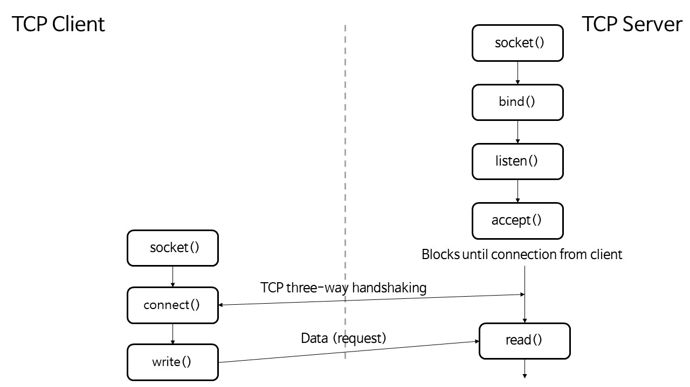
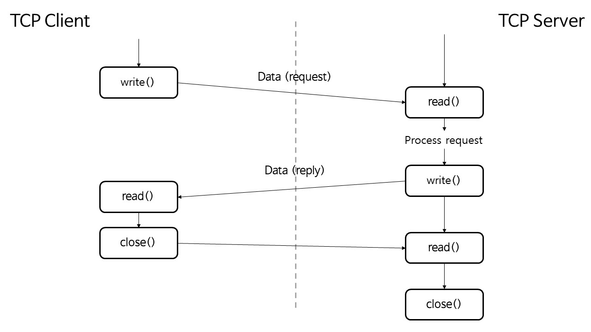

# Network 3강

> UDP와 TCP를 이용한 Socket 프로그래밍

## Socket

> OS라는 우체통에다가 Socket이라는 구멍을 통해 메시지를 전달한다.
>
> process 와 process 사이의 통신을 위한 interface

- An interface between application and network
- TCP
  - SOCK_STREAM
- UDP
  - SOCK_DGRAM

### Sockets API

> 운영체제가 제공하는 System call 중 네트워크와 관련된 기능을 제공하는 System call 들의 집합

- Big picture: Socket Functions (TCP case)

- Socket Creation and Setup (Server)
  - **Create** a socket : 소켓 생성
    - `int socket(int domain, int type, int protocol)`
    - returns file descriptor or -1
    - type : TCP or UDP
  - **Bind** a socket to a local IP address and port number : 소켓에다 port번호 bind
    - `int bind(int sockfd, struct sockaddr* myaddr, int addrlen)`
  - Put socket into passive state (**wait for connections** rather than initiate a connection)
    - `int listen(int sockfd, int backlog)`
    - backlog : 혹시라도 동시에 여러 client의 request가 올 때 처리를 하기 위한 buffer크기
  - **Accept** connections
    - `int accept(int sockfd, struct sockaddr* cliaddr, int* addrlen)`
- Client
  - **Connect**
    - `int connect(int sockfd, struct sockaddr* servaddr, int addrlen)`

