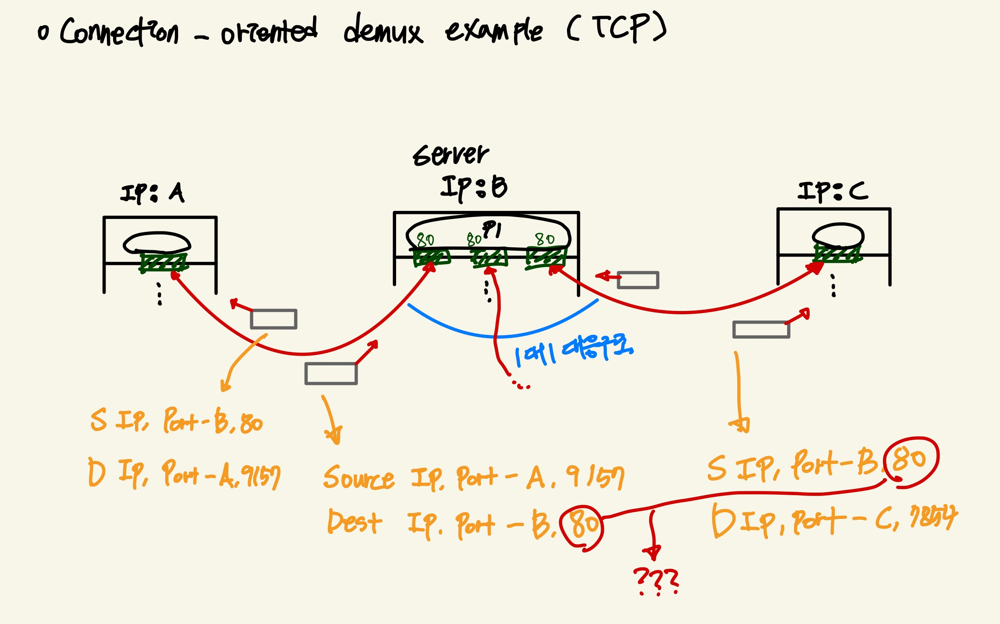
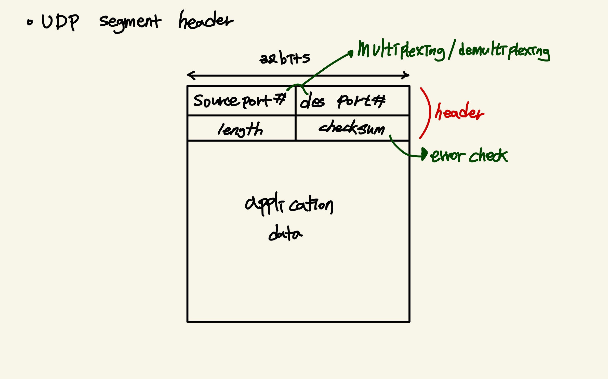

# 네트워크 4강

> 전송 계층 서비스의 원리

## 어플리케이션 계층 마무리

 

### Electronic mail

> 메일을 받는 사람이 항상 컴퓨터를 켜놓지 않지..
>
> mail server

- Three major components
  - user agents
  - mail servers
  - simple mail transfer protocol: SMTP

- SMTP: delivery/storage to receiver's server
- mail access protocol: retrieval from server
  - pop: Post office Protocol [RFC 1939]
  - IMAP
  - HTTP: gmail, naver, etc.

## Transport layer, 전송 계층

> TCP, UDP의 자세한 내용

### Multiplexing/demultiplexing

- 보내는 측 : multiplexing
  - 여러 프로세스에서 보내도 전송은 하나로
- 받는 측 : demultiplexing
  - 목적지 프로세스에 알맞게 전달.

- TCP Socket들은 고유의 포트번호를 갖는다기 보다는 고유의 ID를 갖는다.
  - source IP, Port
  - Destination IP, Port
  - 이 중에 뭔가는 다르겠지

###  UDP multiplexing/demultiplexing

### TCP multiplexing/demultiplexing

### UDP: segment header

- 4개의 field
  - source port
  - destination port
  - length
  - checksum
    - 전송 중 데이터에 에러가 나타났는지 확인하기 위한 것

