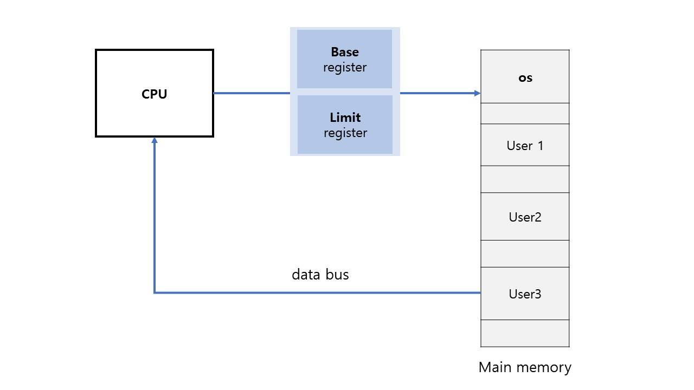

# [운영체제] 이중모드와 보호

우리는 하나의 컴퓨터 내에서 여러 프로그램을 수행하는 것이 일반적이다. 이 때 한 프로그램의 잘못된 동작으로 인해 다른 프로그램이 영향을 받는다면 이는 안전하다고 볼 수 없다.

이러한 문제점을 해결하기 위해서 **이중 모드**라는 것이 나왔다.

 

## 이중 모드 (Dual mode)

- `사용자(User) 모드` : 일반 사용자 모드
- `관리자(Supervisor) 모드` = `특권(priviledged) 모드` : os

 

특권 모드 (관리자 모드)에서만 내릴 수 있는 명령을 **특권 명령(privileged instruction)** 이라고 하며, `STOP`, `HALT`, `RESET`, `SET_TIMER` 등이 있다.

위와 같은 명령을 사용자 모드에서 사용하려고 하면 CPU 내부 인터럽트를 발생시켜 해당 명령어를 요청한 프로그램을 강제 종료시킨다. - **보호(protection)**

이중 모드는 CPU 내부의 레지스터 비트를 활용하여 flag로 나타낸다. `1이면 관리자 모드, 0이면 사용자 모드`

컴퓨터가 켜진 후, 어플리케이션을 실행시킬 때 flag(모드)가 어떻게 변하는지..

1. 컴퓨터 부팅 과정 - 관리자 모드
2. 어플리케이션 실행 과정 - 관리자 모드
3. 어플리케이션 실행 중 - 사용자 모드
4. 인터럽트 발생 후 처리 과정 - 관리자 모드
5. 인터럽트 처리 후 - 사용자 모드

사용자(어플리케이션)이 직접 하드웨어에 접근하는 것은 매우 위험한 동작이다. 그러므로 하드웨어에 접근이 필요한 경우(파일을 저장하거나 .. 등등..) 관리자 모드로 전환하여 운영체제에서 처리하도록 한다.

 

## 하드웨어 보호 3가지

- `입출력 장치 보호`
- `메모리 보호`
- `CPU 보호`

 

### 입출력 장치 보호

컴퓨터에서 발생하는 정보들은 입력 장치를 통해 컴퓨터로 입력되고, 출력 장치를 통해 외부로 출력된다. 이러한 장치들을 보호하지 못한다면 많은 문제를 야기시킬 수 있다.

- 많은 입출력 장치의 사용으로 인한 혼선
- 자신의 데이터가 아닌 다른 사용자의 데이터를 입, 출력 하는 일

위와 같이 입출력 장치에 여러 사용자의 데이터가 섞여 들어오거나, 다른 사용자의 데이터에 접근하는 경우를 방지해야한다. 이를 해결하기 위해서 **입출력 명령을 특권 명령**으로 설정한다.

- `in` : 키보드, 마우스와 같은 입력 장치로부터 정보를 받아들이는 것
- `out` : 출력장치에 출력을 내보내는 명령

즉, 위와 같은 명령을 통해 어플리케이션에서 입출력을 사용하려면 운영체제를 통해서 수행해야 한다.

 

### 메모리 보호

한 어플리케이션이 자신이 할당받은 메모리 영역이 아닌 다른 어플리케이션의 메모리 영역에 접근하려한다면 이는 매우 위험하다.

CPU는 address bus를 통해 메모리 주소에 접근하게 된다. 위와 같이 한 user가 접근하려는 메모리 주소가 자신이 할당받은 메모리 영역 안에 존재하는지를 확인하기위해  address bus에서 검사를 수행한다.

- `MMU (Memory management unit)` : address bus 중간에 설치된 하드웨어 칩으로서 두개의 레지스터 (**base, limit**)를 통해 해당 프로세스의 주소 범위를 저장한다.
- base와 limit 사이의 주소 범위에 접근하려고 한다면 통과시킨다.
- 주소 범위 밖의 주소를 접근하려고 한다면 MMU에서 내부 인터럽트를 발생시켜 CPU에 신호를 보낸다. 그러면 CPU는 ISR로 이동하여 해당 프로그램을 종료시킨다.
  - `Segment violation`

 

### CPU 보호

하나의 사용자가 CPU를 독점하려는 것을 방지해야 한다.

그러기 위해서 Timer를 두어 일정 시간이 지나면 **타이머 인터럽트**를 발생시킨다. 타이머 인터럽트가 발생하면 ISR로 이동하여 각 프로그램의 CPU 점유 시간을 측정하여 조정시켜준다.