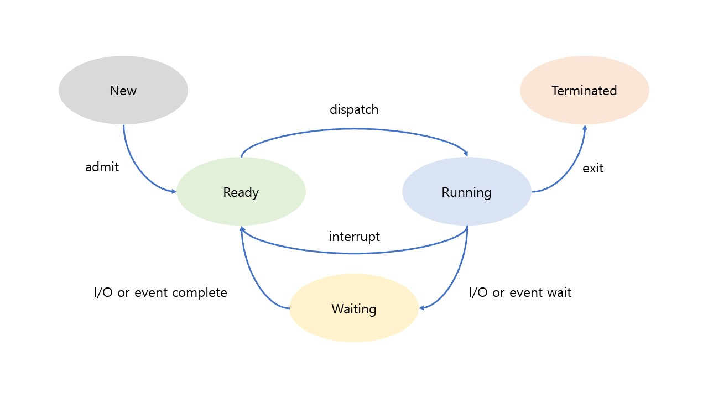
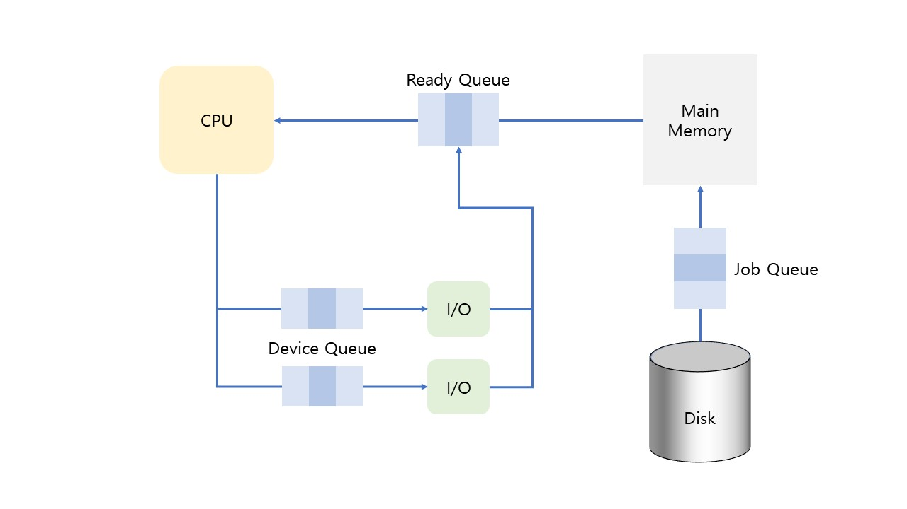

# [운영체제] 프로세스 관리

 

## 1. 프로세스

프로세스는 **메인 메모리에 할당되어 실행중 상태**인 프로그램을 말한다. 프로그램은 보조기억장치에 저장되어 아무 일도 하지 않는 상태이다.

 

### 1.1 프로세스의 상태

- `New` : 프로그램이 메인 메모리에 할당된다.
- `Ready` : 할당된 프로그램이 실행을 위한 모든 준비 단계를 마친다.
- `Running` : CPU가 해당 프로세스를 실행한다.
- `Waiting` : 프로세스가 아직 끝나지 않은 상태에서 I/O로 인해 CPU를 사용하지 않고 다른 작업을 한다. 해당 작업이 끝나면 다시 실행되기 위해서 Ready 상태로 돌아가야 한다.
- `Terminated` : 프로세스가 완전히 종료된다.

다음은 **프로세스 상태 전이도**의 모습니다. New부터 프로세스가 어떻게 상태가 변하는지 나타낸다.

running에서 ready로 변할 때는 **time sharing system**에서 해당 프로세스가 CPU시간을 모두 소진하였을 때 인터럽트(timeout interrupt)가 발생해 강제로 ready 상태로 변하고, CPU는 대기중인 다른 프로세스를 실행시킨다.

 

### 1.2 PCB(Process Control Block)

`PCB`는 각 프로세스에 관한 모든 정보가 담겨있는 곳으로, `Task Control Block(TCB)`이라고 한다.

PCB에는 프로세스의 상태, 프로세스 번호(PIC), 해당 프로세스의 program counter(pc), register 값, MMU정보, CPU 점유 시간 등이 포함되어 있다. PCB는 운영체제 내부의 프로세스를 관리하는 코드 부분에 저장되어 있다.

CPU는 한 프로세스가 종료될 때까지 수행하는 것이 아니라 여러 프로세스를 바꿔가면서 수행한다. 그러므로 실행중인 프로세스를 나갈 때 (context switching), 해당 프로세스의 정보를 저장해두어야 다음에 다시 그 프로세스를 실행할 때 어느 부분에서부터 시작해야하는지 알 수 있다. 이러한 정보들을 저장하는 곳이 `PCB`이다.

 

## 1.3 프로세스 큐(Queue)

프로세스는 실행 중에 상태가 여러 번 변하게되는데 상황에 따라 서비스를 받아야 하는 곳이 다르다. 또한 프로세스는 하나만 실행되는 것이 아니라 여러 개가 같이 실행되기 때문에 실행 순서가 필요하다. 이러한 순서를 위해 대기하는 곳을 **프로세스 큐 (Queue, FIFO 구조)** 라고 한다.

 

- `Job Queue` : 보조 기억 장치에 있는 프로그램이 실행되기 위해 메인 메모리를 할당을 기다리는 큐이다.
- `Ready Queue` : CPU 점유를 기다리는 큐이다.
- `Device Queue` : I/O를 하기 위한 장치를 기다리는 큐이다. I/O 장치는 여러가지이므로 큐도 각각 존재한다.

 

큐 내부에 저장된 실제 데이터는 각 프로세스의 정보가 담겨있는 `PCB`에 저장되어 있다.

순서를 기다리는 큐가 있다면 순서를 정해주는 알고리즘 또한 존재해야한다. 이러한 알고리즘을 **스케줄링(Scheduling)**이라고 한다.

**Job Queue**의 순서를 정해주는 **Job Scheduler**를 **Long-term Scheduler**라고 한다. 이유는 스케줄링이 발생하는 시간이 비교적 오래걸리기 때문이다. 반면에 **Ready Queue**의 스케줄러는 **Short-term Scheduler**라고 하는데, 스케줄링이 매우 빈번하게 일어나기 때문이다. 현재 우리가 사용하는 컴퓨터는 여러 개의 프로세스를 동시에 사용하는 것과 같은 느낌을 들게 하는데, 이 이유는 스케줄링의 속도가 매우 빠르게 이루어지기 때문이다.

 

## 2. 멀티프로그래밍(Multiprogramming)

멀티프로그래밍은 단일 CPU환경에서 **여러 개의 프로세스가 동시에 실행되는 것**을 말한다. 여러 프로세스가 실행되려면 해당 프로세스들은 모두 메인 메모리에 존재하여야 한다. (CPU는 메인 메모리와만 소통한다.)

 

### 2.1 Degree of Multiprogramming

현재 메모리에 할당되어 있는 프로세스의 개수를 말한다.

 

### 2.2 I/O bound process & CPU bound process

- `I/O bound process` : I/O 작업이 차지하는 비중이 높은 프로세스를 말한다.
- `CPU bound process` : CPU 작업이 차지하는 비중이 높은 프로세스를 말한다.

**Job Scheduler**는 두 가지 프로세스 종류를 적절히 분배시켜 메모리에 할당해주어야 한다.

 

### 2.3 Medium-term Scheduler

말 그대로 스케줄링이 Long-term보다는 자주 발생하지만 Short-term보다는 덜 발생하는 Scheduler 이다.

운영체제가 일을 수행하는 동안 주기적으로 메인 메모리에 할당된 전체 프로세스를 검사하여 보조 기억 장치로 옮길 프로세스를 찾아 옮긴다. 대표적으로 장기간 사용하지 않은 프로세스를 옮긴다.

이러한 동작을 **Swapping **이라고 한다. 메인 메모리에서 장시간 사용하지 않은 프로세스를 하드디스크(**Swap Device** == Backing store)로 옮겨주고 (**Swap out**), 나중에 다시 해당 프로세스가 사용되려 하면 하드디스크에서 해당 프로세스를 메인 메모리에 할당해준다. (**Swap in**)

위와 같은 동작이 있어 메인 메모리의 공간이 생기므로 더욱 효율적으로 사용할 수 있다. 하지만 Swap out된 프로그램이 다시 Swap in으로 메인 메모리에 할당되었을 때, 이전 공간으로 할당되는 것은 보장되지 않는다. 다른 프로세스가 그 사이에 해당 메모리 공간을 할당 받을 수 있기 때문이다.

 

### 2.4 Context switching (문맥 전환)

`Context switching`은 CPU가 수행중인 프로세스를 멈추고 다음 프로세스를 실행하는 것을 말한다.

- Scheduler : CPU가 어떤 프로세스를 선택할지 정한다.
- Dispatcher : context switching이 발생하면 CPU의 내부 데이터를 이전 프로세스 데이터에서 다음 데이터로 바꿔준다. 즉, 실행중이던 프로세스와 관련된 데이터를 PCB에 갱신하고, 다음 프로세스의 PCB 데이터를 CPU로 복원(restore)해준다.
- **Context switching overhead** : Context Switching이 발생할 때마다 위에서 언급한 dispatch 작업을 매번 해야하며 이 모든 것은 overhead이다. 그리고 매우 빈번하게 context switching이 일어나므로 dispatcher를 구현하는 코드의 효율을 최대한 높여주어야 한다.