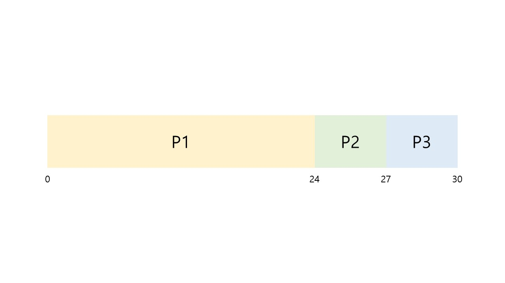
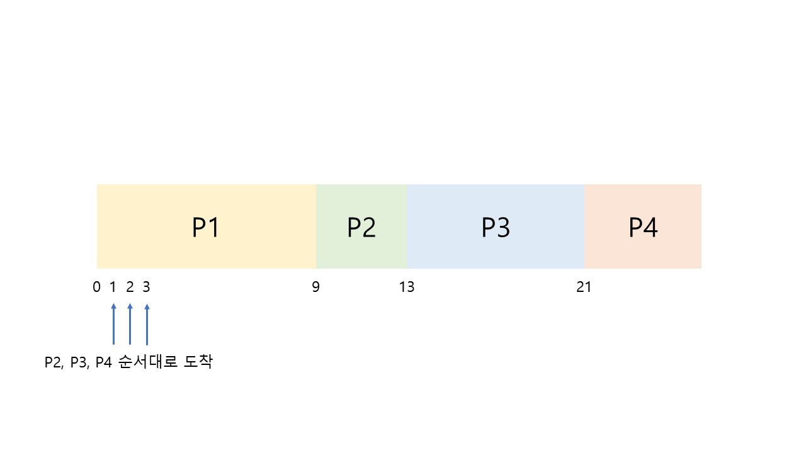
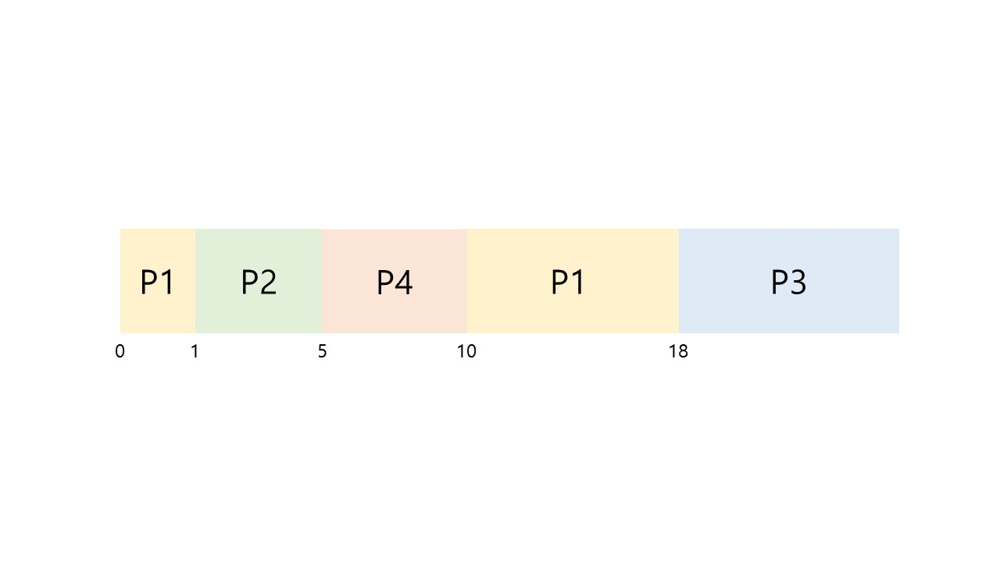
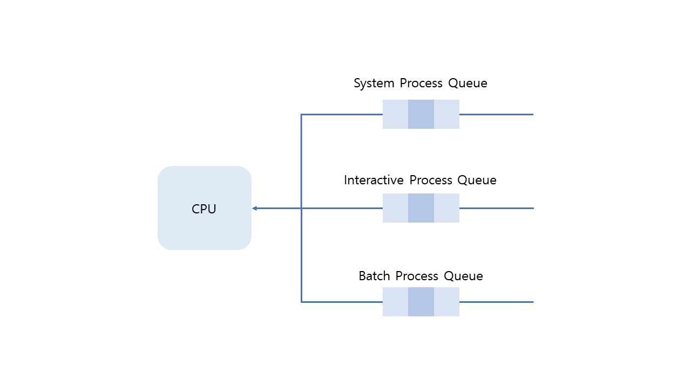
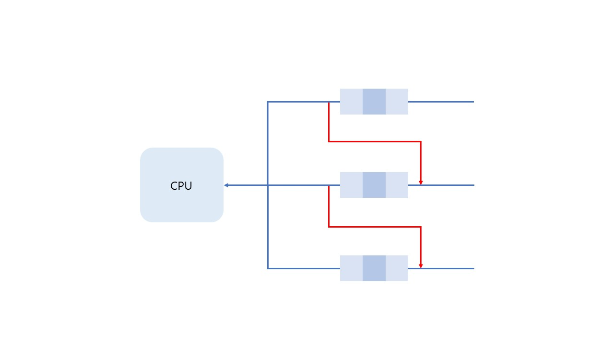

# [운영체제] CPU 스케줄링

CPU가 진행중인 프로세스 작업이 끝나면 다음 프로세스 작업을 수행한다. 이때 다음 프로세스를 선택하는 알고리즘이 `CPU Scheduling` 알고리즘이라고 한다.

단순하게 먼저 대기중이던 프로세스를 실행하는 것이 가장 좋을 것이라고 생각할 수 있지만, 어떤 상황에서는 이러한 방법이 좋다고 할 수 없다.

CPU 스케줄링은 여러가지 방법이 존재한다.

 

## 1. Preemptive(선점) vs Non-preemptive(비선점)

 

### 1.1 Preemptive(선점)

Preemptive(선점)은 프로세스가 CPU를 점유하고 있는 동안 인터럽트가 발생하거나 작업이 끝나지도 않았는데, 다른 프로세스가 **CPU를 강제로 점유** 할 수 있다.

 

### 1.2 Non-preemptive(비선점)

선점과 반대로 한 프로세스가 CPU를 점유했다면 I/O, 인터럽트 혹은 프로세스가 종료될 때까지 다른 프로세스가 CPU를 점유할 수 없다.

 

## 2. Scheduling criteria

> 스케줄링의 효율을 분석하는 기준들

- CPU Utilization(이용률, %) : CPU가 수행되는 비율
- Throughput(처리율, jobs/sec) : 단위 시간당 처리하는 작업의 수
- Turnaround time(반환 시간) : 프로세스의 처음 시작 시간부터 모든 작업을 끝내고 종료하는데 걸린 시간이다.
- Waiting time(대기 시간) : CPU를 점유하기 위해서 `ready queue`에서 기다린 시간을 말한다. 다른 queue에서 대기한 시간은 제외한다.
- Response time(응답 시간) : 일반적으로 대화형 시스템에서 입력에 대한 반응 시간을 말한다.

 

## 3. CPU Scheduling Algorithms

 

### 3.1 First-Come First-Served(FCFS)

먼저 들어온 프로세스가 먼저 CPU를 점유하는 방식이다. (First In First Out과 비슷하다고 보면 되겠군..) 단순하고 많이 사용되는 방법이지만, 모든 부분에서 효율적인 것은 아니다.

 

- Gantt Chart

| Process | Burst Time(CPU 점유 시간, msec) |
| ------- | ------------------------------- |
| P1      | 24                              |
| P2      | 3                               |
| P3      | 3                               |

 

위의 표를 그림으로 표현한 모습이다. 3개의 프로세스와 각 프로세스의 CPU 점유 시간을 나타냈다. 이를 통해 평균 대기시간을 계산하면 다음과 같다.

- 평균 대기 시간 (Average waiting time) : (0 + 24 + 27) / 3 = **17 msec**

만약 점유 순서가 **P3 -> P2 -> P1** 이었다면 평균 대기 시간은 **3 msec**로 현저히 줄었을 것이다. 결과적으로 두 방법 모두 모든 프로세스가 종료되는 시간은 30 msec로 동일하지만 효율을 분석하는 기준 중 하나인 **Waiting time**으로 보았을 때는 동일한 효율이라고 볼 수 없다.

**P1 -> P2 -> P3** 순서로 들어온 것을 `Convoy Effect`라고 한다. 이는 CPU 시간을 오래 사용하는 프로세스가 먼저 실행하는 동안 나머지 프로세스들이 오래 기다리는 것을 말한다. 이는 `FCFS`의 단점 중 하나이다.

FCFS는 **Non-preemptive**이다. (하나의 프로세스가 종료되지 전에 다른 프로세스가 중간에 끼어들 수 없다.)

 

### 3.2 Shortest-Job-First(SJF)

가장 짧은 시간 내에 수행되는 프로세스가 먼저 수행되는 것을 말한다.

위 방식을 사용한다면 어떠한 상황이더라도 **평균 대기 시간이 가장 짧다.**

하지만 위의 방법은 **비현실적**이다. 컴퓨터 환경에서 각 프로세스의 CPU 점유 시간(Burst time)을 알 수 없기 때문이다. 프로세스가 실행 중에는 많은 변수가 존재하기 때문에 실제로 수행하면서 측정하는 수 밖에 없다.

SJF는 **Preemptive와 Non-preemptive 둘 다 사용가능하다.**

기존 예제와 다르게 ready queue에 도착하는 arrival time(도착 시간)을 추가한 예제를 보면 다음과 같다.

 

| Process | Arrival Time | Burst Time(msec) |
| ------- | ------------ | ---------------- |
| P1      | 0            | 9                |
| P2      | 1            | 4                |
| P3      | 2            | 8                |
| P4      | 3            | 5                |

- Non-preemptive

 

- Preemptive

1msec 지점에서 P2가 도착했고, **현재 남은 burst time 중 가장 짧은 프로세스**가 P2이므로 P1을 중단하고 P2가 수행을 시작한다.

Preemptive SJF는 위와 같이 현재 남아있는 시간이 가장 짧은 프로세스를 선택하므로 Shortest-Remaining-Time-First 라고 불리기도 한다.

 

### 3.3 Priority

**우선순위가 높은** 프로세스가 먼저 선택되는 스케줄링 알고리즘이다. 일반적으로 우선순위는 정수값으로 나타내며, 작은 값이 우선순위가 높다.

우선순위를 결정하는 방법은 크게 내부적인 요소와 외부적인 요소로 나뉜다.

- `Internal` : time limit, memory requirement, I/O to CPU burst(I/O 작업은 길고, CPU 작업은 짧은 프로세스 우선) 등
- `External` : amout of funds being paid, political factors 등

Priority 스케줄링 또한 Preemptive 와 Non- Preemptive 두 방식 모두 사용할 수 있다.

Priority 스케줄링의 문제점은 **Starvation(기아)**이 발생할 수 있다는 것이다. 즉, CPU를 점유하지 못하는 프로세스가 발생할 수 있다는 것이다.

ready queue에 우선순위가 낮은 프로세스가 대기하고 있다고 가정해보자. 이때 계속해서 우선순위가 더 높은 프로세스가 들어오게 된다면 우선순위가 낮은 프로세스는 아무리 기다려도 CPU를 점유할 수 없을 것이다.

이를 해결하는 방법 중 하나로 **aging**이 있다. 이 방식은 ready queue에서 기다리는 동안 일정 시간이 지나면 우선순위를 높여주는 방식이다. 그렇게 되면 우선순위가 낮은 프로세스도 시간이 지나면 우선순위가 높아져 수행될 수 있다.

 

### 3.4 Round-Robin (RR)

원 모양으로 모든 프로세스가 돌아가며 스케줄링 하는 것을 의미한다. 주로 시분할 시스템에서 사용하는 방식이다. 일정 시간을 정해놓고 하나의 프로세스가 해당 시간동안 수행하고 다시 대기 상태로 돌아간 후, 다음 프로세스가 CPU를 점유한다. 이러한 방식을 반복한다.이러한 일정 시간을 **Time Quantum(Time Slice)**이라 부른다.

Round-Robin 은 기본적으로 **preemptive**이다. 한 프로세스가 종료되기 전에 time quantum이 끝나면

Round-Robin 방식은 time quantum에 따라 효율이 바뀐다. (**time quantum에 매우 의존적이다. **)

만약 time quantum을 무한대에 가깝게 설정한다면 FCFS(First-Come-First-Served)와 동일하게 동작할 것이고, 반대로 0에 가깝게 설정한다면 switching overhead가 증가하여 비효율적일 것이다. 그러므로 time quantum을 적당한 크기로 설정해주어야 하는데, 일반적으로 10 ~ 100msec으로 정한다.

 

### 3.5 Multilevel Queue

프로세스는 기준에 따라 여러 그룹으로 나눌 수 있다.

- System Processes : 운영체제 커널 수준의 프로세스
- Interactive Processes : 유저 수준의 대화형 프로세스
- Interactive editing Processes
- Batch Processes : 대화형 프로세스의 반대로 일정량을 한 번에 처리하는 프로세스(ex, Compiler)
- Student Processes

위와 같이 여러 성격에 따라 프로세스를 나눌 수 있는데 이러한 프로세스를 하나의 queue에 담는 것은 비효율적이다. 그래서 그룹에 따라 큐를 두어 여러개의 큐를 사용하는 것을 **Multilevel Queue**

위와 같이 그룹에 따라 큐를 나누게 되면 **큐마다 우선순위를 지정해줄 수 있다.** 커널 수준에서 중요한 작업을 하는 System process는 우선순위가 높은 그룹이라 볼 수 있다. 반대로 Batch process는 운영체제의 개입이 매우 적으므로 우선순위가 가장 낮다고 볼 수 있다.

이처럼 큐에 따라 우선순위를 나누게 되면 CPU 시간을 다르게 줄 수도 있고, 큐마다 스케줄링 방식을 다르게 할 수도 있다.

 

### 3.6 Multilevel Feedback Queue

위의 그림처럼 Multilevel Queue와 비슷하게 여러 개의 큐를 사용한다는 점에서 유사하다.

일단 모든 프로세스는 가장 위의 큐에서 (우선순위가 높은 큐) CPU 점유를 대기한다. 이 상태로 진행 중 너무 오랜 시간을 기다리게 된다면 **아래의 큐로 프로세스를 옮긴다.** 만약 우선순위가 낮은 아래의 큐에 있는 프로세스에서 Starvation(기아) 상태가 발생하면 이를 우선순위가 높은 큐로 옮길 수도 있다.

이또한 각 큐마다 스케줄링 방식, 우선순위 등을 다르게 사용할 수 있다.

대부분 상용 운영체제는 여러 개의 큐를 사용하고 각 큐마다 다른 스케줄링 방식을 채택한다. 프로세스의 성격에 맞게 스케줄링 방식을 사용하여 효율을 최대한으로 높일 수 있는 방법을 선택한다.