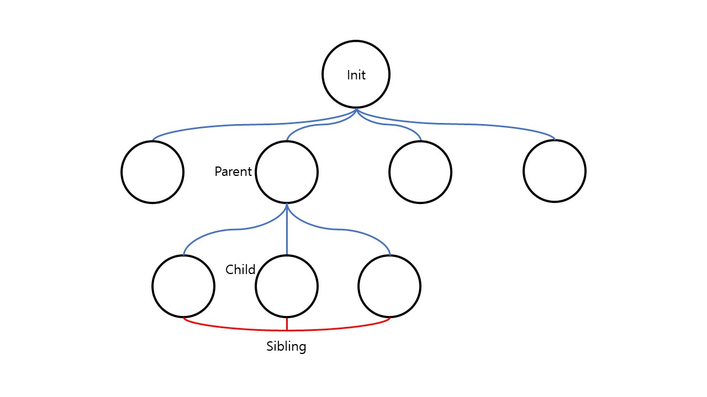

# [운영체제] 프로세스와 쓰레드(Thread)

 

## 1. 프로세스 생성과 종료

> 프로세스는 프로세스에 의해 만들어진다.

컴퓨터가 부팅 되면 보조 기억 장치에 있는 운영체제가 메인 메모리에 올라오는데, 이 때 처음으로 수행하는 일 중 하나는 **최초의 프로세스를 생성**하는 것이다.

최초로 만든 프로세스가 자식 프로세스를 만들고, 그 프로세스 들이 또 다른 프로세스들을 만드는 과정을 반복한다.

 

위와 같이 최초의 프로세스는 UNIX 운영체제 기준으로 **Init**이라고 한다. 이 후 다른 프로세스들을 만들게 되면 그림과 같이 **트리 모양**형태를 가지게 된다.

프로세스를 생성한 프로세스를 **부모 프로세스**, 만들어진 프로세스를 **자식 프로세스**라고 한다. 그리고 같은 부모 프로세스로부터 생성된 자식 프로세스들은 서로 **형제(Sibling)** 프로세스라고 한다.

각각의 프로세스는 고유한 번호를 갖는데 이를 **PID(Process Identifier)**라고 한다. 각 프로세스의 부모의 PID는 **PPID**라고 한다.

 

### 1.1 프로세스 생성

새로운 프로세스를 생성하는 시스템 콜은 `fork()`라 한다. 만들어진 프로세스에서 어떤 파일을 실행하려면 `exec()` 시스템 콜을 사용한다.

 

### 1.2 프로세스 종료

프로세스를 종료하는 시스템 콜은 `exit()`이다. 프로세스가 종료되면 해당 프로세스가 사용한 메모리, I/O 등의 자원을 회수해야한다. 회수된 자원과 권한은 모두 운영체제로 돌아가야한다.

 

## 2. 쓰레드 (Thread)

일반적으로 하나의 프로그램은 하나의 쓰레드를 갖는다.

 

### 2.1 다중 쓰레드(Multithreads)

하나의 프로그램에 쓰레드가 두 개 이상 존재하는 것을 **다중 쓰레드**라고 한다.

CPU하나에서 쓰레드가 빠른 시간 간격으로 스위칭되면 사용자는 여러 쓰레드가 동시에 실행되는 것처럼 보인다. 이러한 것을 **concurrent**라고 한다.

반면에 실제로 여러 CPU환경에서 여러 쓰레드가 실행되는 것은 **simultaneous**라고 한다.

다중 쓰레드를 사용하는 대표적인 예는 웹 브라우저 이다. 화면을 출력하는 쓰레드와 데이터를 읽어오는 쓰레드가 따로 수행하고 있다. (자바스크립트는 싱글 쓰레드..) 그 외에도 현재 대부분의 프로그램은 다중 쓰레드로 동작한다.

현재 운영체제에서는 다중 쓰레드를 지원하기 때문에 하나의 프로세스의 여러 쓰레드를 수행하다가 다음 프로세스로 넘어가서 해당 프로세스의 쓰레드를 수행한다. 따라서 현재 운영체제의 **context switching 단위는 Thread 이다.**

 

### 2.2 Thread와 Process

한 프로세스에는 기본적으로 하나의 쓰레드가 존재한다. 프로세스는 code, data 메모리 공간이 존재하는데 이 자원들을 여러 쓰레드가 공유한다. 그리고 각 쓰레드가 고유하게 가지는 것은 **PC(Program Counter), SP(Stack Pointer), registers, stack** 등이 있다.