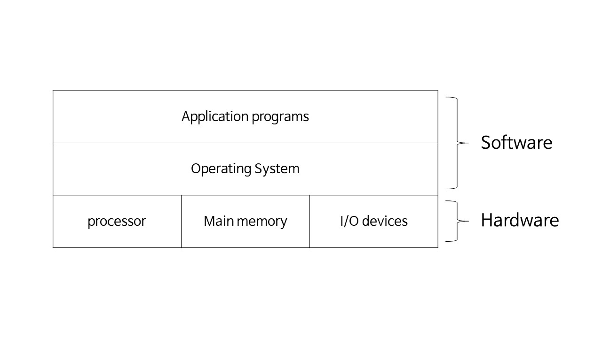

# 운영체제 개요

> 우리가 접하는 컴퓨터는 하드웨어 자체가 아니라 os가 만드는 가상세계를 접하는 것이다.

## Operating system?

A layer of software between application programs and the hardware

우리가 사용하는 컴퓨터, 스마트폰을 컴퓨터라고 하지만 비행기, 티비 등 프로그램이 돌아가는 모든 것들도 컴퓨터 (내장형 컴퓨터, 임베디드 컴퓨터)라고 할 수 있다.

이러한 모든 컴퓨터 시스템에는 운영체제가 들어가 있다.

하드웨어를 직접 명령내리는 것은 어려우니까 os가 해준다.

## Instruction set architecture (ISA) (Machine language)

> Define the interface between SW and HW
>
> 사람도 사람마다 언어가 다르듯, 기계도 기계마다 언어가 다르다. 
>
> ex) x86-64

- 같은 x86끼리는 명령에 대해서는 동일하지만 64비트, 32비트 등 메모리의 크기가 다르다. 

- 아이폰, 갤럭시 등 - ARM이라고 하는 RISC Processor가 설치되어 있어 다른 machine language 를 사용한다.
  - 모바일 앱을 윈도우에서 사용할 수 없다!

## Application binary interface (ABI)

> Define the system call interface to OS
>
> OS를 직접 부르는 System call interface

## Application programming interface (API)

> Define the program call interface to system services. System calls are performed through library calls
>
> 프로그램에서 system call을 하기 위한 library

## CISC (Complex Instruction Set Computer)

> 명령어 수도 많고 복잡함.. 구식

- ex) x86, VAX

## RISC (Reduced Instruction Set Computer)

> 명령어가 복잡하면 기계구조가 복잡해지고 성능이 떨어진다
>
> 하나의 명령어를 다른 명령어 몇개로 만들면 되지..``

