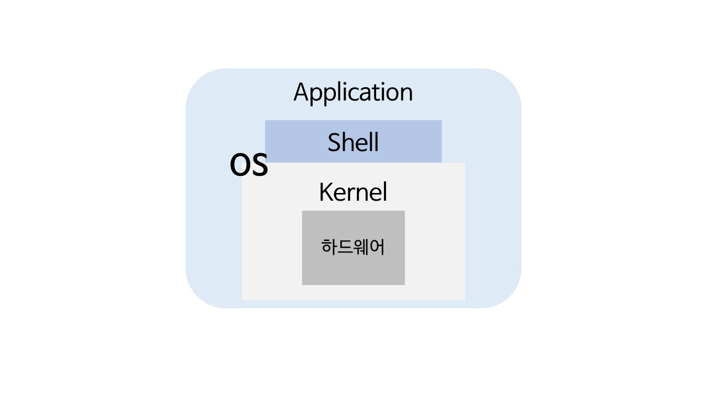

# [운영체제] 운영체제 개요

 

## 운영체제의 목적

우리가 사용하는 컴퓨터에는 수많은 하드웨어가 존재한다. (CPU, 메모리, I/O 등)

이러한 것들을 잘 관리해주어야 컴퓨터를 효율적으로 사용할 수 있다. 운영체제는 앞서 언급한 **자원들을 효율적으로 사용**하기 위해 **하드웨어를 관리**하는 것이 주된 목적이다.

또한, 운영체제는 **사용자에게 편의**를 제공한다. 운영체제가 없다면 사용자는 하드웨어를 직접 다뤄야하므로 어려움을 느낄 수 있다.

즉, 운영체제는 컴퓨터의 성능을 높이고, 사용자에게 편의를 제공하는 것을 목적으로 하는 **컴퓨터 하드웨어 관리 프로그램**이라고 할 수 있다.

 

## 부팅

> 단순하게 Processor(CPU), 하드디스크, main memory로 부팅을 설명한다.

Main memory는 `ROM`과 `RAM`으로 나누어져 있다.

- ROM
  - 비휘발성으로 메모리에서 극히 일부를 차지한다.
- RAM
  - 휘발성으로 main memory의 대부분을 차지하며 실제 process가 할당되는 곳이다.
  - 휘발성이므로 전원이 꺼지면 메모리안의 내용이 지워진다.

 

컴퓨터의 전원이 켜지면 CPU에서 ROM에 있는 `POST (Power-On Self-Test)`를 실행한여 현재 컴퓨터의 상태를 검사한다. 이후, ROM에 있는 `boot loader`를 실행한다. boot loader는 하드디스크에 저장되어 있는 운영체제를 찾아서 RAM에 가지고 온다. 이러한 과정을 **부팅**이라고 한다.

반대로 운영체제가 종료되는 시점은 컴퓨터의 전원이 꺼지는 시점이다.

 

### 운영체제

운영체제는 크게 `kernel`과 `명령어 해석기 (Command interpreter, shell)`로 나뉜다.

커널을 운영체제의 핵심으로 운영체제가 수행하는 모든 것이 저장되어있다. 명령어 해석기는 사용자가 운영체제에 요청하는 명령어를 해석하여 커널에 요쳥하고 그 결과를 출력한다.

사용자는 `GUI(Graphic User Interface, 버튼 등을 통해)`, `CLI(Command Line Interface, git 명령어 같은..)` 등의 방식으로 운영체제에 명령을 요청한다.

 

## 운영체제의 위치

> 하드웨어 > 운영체제 > 애플리케이션

애플리케이션은 운영체제 위에서 수행한다. 즉, 하드웨어 자원을 직접적으로 가져다가 사용하지 않고 운영체제가 제공하는 자원만을 사용할 수 있다.

- CPU, 메모리, 하드디스크 등 하드웨어 자원을 효율적으로 사용해야한다.
- 이러한 자원을 효율적으로 관리하기 위해 **프로세스 관리, 메모리 관리, 디스크 관리, 보안 등** 기능이 나눠져 있다.
- 애플리케이션들의 요청에 따라 각 기능등을 수행하여 적절히 자원을 분배한다.

