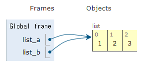
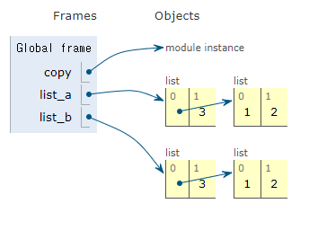

# Data Structure (데이터 구조)

> 데이터 구조(Data Structure)란 데이터에 편리하게 접근하고, 변경하기 위해서 데이터를 저장하거나 조작하는 방법을 말한다.


**Program = Data Structure + Algorithm**


## 문자열(String)

> 변경할 수 없고(immutable), 순서가 있고(ordered), 순회가 가능한(iterable)

[문자열의 다양한 조작법(method)](https://docs.python.org/ko/3/library/stdtypes.html#string-methods)


### .find(x)

- x의 **첫 번째 위치**를 반환한다. 없으면, -1을 반환한다.


```python
a = 'apple'
a.find('p') # p는 1번 인덱스에서 처음으로 찾을 것이기 때문에 1을 출력할 것이다.
```

```
1
```


### .index(x)

- xdml **첫 번째 위치**를 반환한다. 없으면, 오류가 발생한다.


```python
a = 'apple'
a.index('p')
```

```
1
```


```python
a = 'apple'
a.index('x')
```

```
---------------------------------------------------------------------------
ValueError                                Traceback (most recent call last)
<ipython-input-4-a658d21ae277> in <module>
      1 a = 'apple'
----> 2 a.index('x')

ValueError: substring not found
```


### .replace(old, new[, count])

- 바꿀 대상 글자를 새로운 글자로 바꿔서 반환한다.
- count를 지정하면 해당 갯수만큼만 시행한다.


```python
z = 'zoo!yoyo!'
z.replace('o', '')
```

```
'z!yy!'
```


```python
z = 'zoo!yoyo!'
z.replace('o', '', 2)
```

```
'z!yoyo!'
```


### .strip([chars])

- 특정한 문자들을 지정하면, 양쪽을 제거하거나 왼쪽을 제거하거나(`lstrip`), 오른쪽을 제거합니다(`rstrip`).
- 지정하지 않으면 공백을 제거합니다.


```python
oh = '    oh!\n'
oh.strip() # default로 양쪽 공백을 제거!
```

```
'oh!'
```


```python
oh.rstrip() # 오른쪽 공백을 제거!
```

```
'    oh!'
```


### .split()

- 문자열을 특정한 단위로 나누어 리스트로 반환합니다.
- 괄호 내에 문자를 입력하지 않으면 공백을 기준으로 나눈다.


```python
csv = '1,홍길동,01012344567'
my_list = csv.split(',')
print(my_list, type(my_list))
```

```
['1', '홍길동', '01012344567'] <class 'list'>
```


### 'separator'.join(iterable)

- 특정한 문자열로 만들어 반환합니다.
- 반복가능한(iterable) 컨테이너의 요소들을 separator를 구분자로 합쳐(`join()`) 문자열로 반환합니다.


```python
my_list = ['1', '2', '3']
'<'.join(my_list)
```

```
'1<2<3'
```


### .capitalize(), .title(), .upper()

- `.capitalize()` : 앞글자를 대문자로 만들어 반환한다.
- `.title()` : 어포스트로피나 공백 이후를 대문자로 만들어 반환한다.
- `.upper()` : 모두 대문자로 만들어 반환한다.


```python
a = 'hI! Everyone, I\'m kim'

print(a.capitalize())
print(a.title())
print(a.upper())
```

```
Hi! everyone, i'm kim
Hi! Everyone, I'M Kim
HI! EVERYONE, I'M KIM
```


### .lower(), .swapcase()

- `lower()` : 모두 소문자로 만들어 반환한다.
- `swapcase()` : 대 <-> 소문자로 변경하여 반환한다.


```python
a = 'hI! Everyone, I\'m kim'

print(a.lower())
print(a.swapcase())
```

```
hi! everyone, i'm kim
Hi! eVERYONE, i'M KIM
```


### 기타 문자열 관련 검증 메서드 : True/False 반환

- .isalpha()
- .isdecimal()
- .isdigit()
- .isnumeric()
- .isspace()
- .isupper()
- .istitle()
- .islower()


## 리스트(List)

> 변경 가능하고(mutable), 순서가 있고(ordered), 순회 가능한(iterable)


[데이터 구조로서의 리스트(list)와 조작법(method)](https://docs.python.org/ko/3/tutorial/datastructures.html#more-on-lists)


### 값 추가 및 삭제


#### .append(x)

- 리스트에 값을 추가할 수 있다.


```python
cafe = ['starbucks', 'tomntoms', 'hollys']
cafe.append('twosome')
print(cafe)
```

```
['starbucks', 'tomntoms', 'hollys', 'twosome']
```


#### .extend(iterable)

- 리스트에 iterable(list, range, tuple, string**[주의]**) 값을 붙일 수가 있습니다.


```python
cafe.extend(['bluebottle']) # 리스트 안에 넣지 않고 진행하면 개별 char가 리스트의 원소로 들어간다.
```

```
['starbucks', 'tomntoms', 'hollys', 'twosome', 'bluebottle']
```


#### .insert(i, x)

- 정해진 위치 `i`에 값을 추가합니다.


```python
cafe.insert(0, 'angel')
```

```
['angel', 'starbucks', 'tomntoms', 'hollys', 'twosome', 'bluebottle']
```


#### .remove(x)

- 리스트에서 값이 x인 것을 삭제합니다.


```python
numbers = [1, 2, 3, 1, 2]
numbers.remove(1)
print(numbers)
```

```
[2, 3, 1, 2]
```


#### .pop(i)

- 정해진 위치 i에 있는 값을 삭제하며, 그 항목을 `반환`합니다.
- i가 지정되지 않으면 마지막 항목을 삭제하고 되돌려줍니다.


```python
a = [1, 2, 3, 4, 5, 6]
num = a.pop(0)
print(num, a)
```

```
1 [2, 3, 4, 5, 6]
```


```python
a = [1, 2, 3, 4, 5, 6]
num = a.pop()
print(num, a)
```

```
6 [1, 2, 3, 4, 5]
```


#### .clear()

- 리스트의 모든 항목을 삭제합니다.


```python
a = [1, 2, 3, 4, 5, 6]
a.clear()
print(a)
```

```
[]
```


### 탐색 및 정렬


#### .index(x)

- x 값을 찾아 해당 index 값을 반환합니다.
- 없을 시 오류가 발생합니다.


```python
a = [1, 2, 3, 4, 5]
print(a.index(3))
```

```
2
```


```python
a = [1, 2, 3, 4, 5]
print(a.index(7))
```

```
---------------------------------------------------------------------------
ValueError                                Traceback (most recent call last)
<ipython-input-41-cc78ef4b3025> in <module>
      1 a = [1, 2, 3, 4, 5]
----> 2 print(a.index(7))

ValueError: 7 is not in list
```


#### .count(x)

- 원하는 값의 개수를 확인할 수 있습니다.


```python
a = [1, 2, 5, 1, 5, 1]
print(a.count(5))
```

```
2
```


- 원하는 값 모두 삭제하기

```python
a = [1, 2, 5, 1, 5, 1]
while a.count(5)!=0:
    a.remove(5)
    
print(a)
```

```
[1, 2, 1, 1]
```


#### .sort()

- 정렬 합니다.
- 내장함수 `sorted()` 와는 다르게 **원본 list를 변형**시키고, `None`을 리턴합니다.


```python
a = [1, 2, 5, 1, 5, 1]
b = a.sort()
print(b, a)
```

```
None [1, 1, 1, 2, 5, 5]
```


#### .reverse()

- 반대로 뒤집습니다. **(정렬 아님)**


```python
classroom = ['Tom', 'David', 'Justin']
classroom.reverse()
print(classroom)
```

```
['Justin', 'David', 'Tom']
```


### 리스트 복사


```python
a = [1, 2, 3, 4, 5]
b = a
b[0] = 100

print(a, b) # 두 리스트의 0번 인덱스 값이 변경된다.
```

```
[100, 2, 3, 4, 5] [100, 2, 3, 4, 5]
```


#### 리스트 복사 방법

- slice 연산자 사용([:])

```python
a = [1, 2, 3, 4, 5]
b = a[:]
b[0] = 100

print(a, b)
```

```
[1, 2, 3, 4, 5] [100, 2, 3, 4, 5]
```


- list() 활용

```python
a = [1, 2, 3, 4, 5]
b = list(a) # list를 새로운 list로 형변환
b[0] = 100

print(a, b)
```

```
[1, 2, 3, 4, 5] [100, 2, 3, 4, 5]
```


**하지만, 이렇게 하는 것도 일부 상황에만 서로 다른 `얕은 복사(shallow copy)` 이다.**


#### 2차원 배열 복사


```python
a = [[1, 2, 3], 4, 5]
b = a[:]
b[0][0] = 100

print(a, b)
```

```
[[100, 2, 3], 4, 5] [[100, 2, 3], 4, 5]
```


- `깊은 복사(deep copy)`를 해야한다.

```python
import copy
a = [[1, 2, 3], 4, 5]
b = copy.deepcopy(a)
b[0][0] = 100

print(a, b)
```

```
[[1, 2, 3], 4, 5] [[100, 2, 3], 4, 5]
```


### List Comprehension


- List Comprehension은 표현식과 제어문을 통해 리스트를 생성합니다.
- 여러 줄의 코드를 한 줄로 줄일 수 있습니다.


- **활용법**

```python
[expression for 변수 in iterable]

list(expression for 변수 in iterable)
```


- **예시**

```python
# 세제곱 리스트를 만들어 보자 (1 ~ 10)

cubic_list = [num**3 for num in range(1, 11)]
print(cubic_list)
```

```
[1, 8, 27, 64, 125, 216, 343, 512, 729, 1000]
```


#### + 조건문

- 조건문에 참인 식으로 리스트를 생성합니다.


- **활용법**

```python
[expression for 변수 in iterable if 조건식]

[expression if 조건식 else 식 for 변수 in iterable]
```


- **예시**

```python
# 짝수 리스트를 작성해보자 (1 ~ 10)

even_list = [num for num in range(1, 11) if num%2 == 0]
print(even_list)
```

```
[2, 4, 6, 8, 10]
```


```python
my_list = [-i if i % 2 == 0 else i for i in range(1, 11)]
print(my_list)
```

```
[1, -2, 3, -4, 5, -6, 7, -8, 9, -10]
```


## 세트(Set)

> 변경 가능하고(mutable), 순서가 없고(unordered), 순회 가능한(iterable)


[데이터 구조로서의 set와 조작법(method)](https://docs.python.org/ko/3/library/stdtypes.html#set-types-set-frozenset)


### 추가 및 삭제


#### .add(elem)

- elem을 세트에 추가합니다.


```python
a = {'사과', '바나나', '수박'}
a.add('토마토')
print(a)
```

```
{'사과', '토마토', '바나나', '수박'}
```


#### .update(*others)

- 여러가지의 값을 추가합니다.
- 인자로는 반드시 iterable 데이터 구조를 전달해야합니다.


```python
a = {'사과', '바나나', '수박'}
b = ['배', '복숭아', '토마토']
a.update(b)
print(a)
```

```
{'사과', '복숭아', '토마토', '배', '바나나', '수박'}
```


#### .remove(elem)

- elem을 세트에서 삭제하고, 없으면 KeyError가 발생합니다.


```python
a = {'사과', '바나나', '수박'}
a.remove('바나나')
print(a)
```

```
{'사과', '수박'}
```


#### .discard(elem)

- elem을 세트에서 삭제하고 없어도 에러가 발생하지 않습니다.


```python
a = {'사과', '바나나', '수박'}
a.discard('수박')
a.discard('복숭아')
print(a)
```

```
{'사과', '바나나'}
```


#### .pop()

- **임의의 원소**를 제거해 반환합니다.


```python
a = {'사과', '바나나', '수박', '아보카도'}
b = a.pop()
print(b, a)
```

```
사과 {'바나나', '수박', '아보카도'}
```


## 딕셔너리(Dictionary)

> 변경 가능하고(mutable), 순서가 없고(unordered), 순회 가능한(iterable)
>
> `Key: Value` 페어(pair)의 자료구조


### 조회


#### .get(key[, default])

- key를 통해 value를 가져옵니다.

- 절대로 KeyError가 발생하지 않습니다. default는 기본적으로 None입니다.


```python
my_dict = {'apple': '사과', 'banana': '바나나', 'melon': '멜론'}
my_dict.get('apple')
```

```
'사과'
```


```python
my_dict = {'apple': '사과', 'banana': '바나나', 'melon': '멜론'}
my_dict['pineapple']
```

```
---------------------------------------------------------------------------
KeyError                                  Traceback (most recent call last)
<ipython-input-19-d3cdd6ee6d26> in <module>
      1 # get을 사용해봅시다.
      2 my_dict = {'apple': '사과', 'banana': '바나나', 'melon': '멜론'}
----> 3 my_dict['pineapple']

KeyError: 'pineapple'
```

```python
my_dict = {'apple': '사과', 'banana': '바나나', 'melon': '멜론'}
x = my_dict.get('pineapple')
print(x)
```

```
None
```


- **중요 예시**

```python
input_str = 'himynameisjiyong'
count = {}
for char in input_str:
    count[char] = count.get(now, 0) + 1

print(count)
```

```
{'h': 1, 'i': 3, 'm': 2, 'y': 2, 'n': 2, 'a': 1, 'e': 1, 's': 1, 'j': 1, 'o': 1, 'g': 1}
```


### 추가 및 삭제


#### .pop(key[, default]).

- key가 딕셔너리에 있으면 제거하고 그 값을 돌려줍니다. 그렇지 않으면 default를 반환합니다.
- default가 없는 상태에서 딕셔너리에 없으면 KeyError가 발생합니다.


```python
my_dict = {'apple': '사과', 'banana': '바나나'}
x = my_dict.pop('apple', False)
print(x, my_dict)
```

```
사과 {'banana': '바나나'}
```


```python
my_dict = {'apple': '사과', 'banana': '바나나'}
x = my_dict.pop('pineapple', False)
print(x, my_dict)
```

```
False {'apple': '사과', 'banana': '바나나'}
```


### 딕셔너리 순회(반복문 활용)

- 딕셔너리에 `for` 문을 실행하면 기본적으로 다음과 같이 동작합니다.


```python
grades = {'john':  80, 'eric': 90, 'justin': 90}
for student in grades:
    print(student)
```

```
john
eric
justin
```


- value를 출력하기 4가지 방법

```python
# 0. dictionary 순회 (key 활용)
for key in dict:
    print(key)
    print(dict[key])


# 1. `.keys()` 활용
for key in dict.keys():
    print(key)
    print(dict[key])


# 2. `.values()` 활용    
for val in dict.values():
    print(val)


# 3. `.items()` 활용
for key, val in dict.items():
    print(key, val)
```


## 데이터 구조에 적용가능한 Built-in Function

> 순회 가능한(iterable) 데이터 구조에 적용가능한 Built-in Function


- `map()`
- `filter()`
- `zip()`


### map(function, iterable)

- 순회가능한 데이터 구조(iterable)의 모든 요소에 function을 적용한 후 그 결과를 돌려준다.
- return은 `map_object` 형태이다


```python
# string '123'으로 만들기
numbers = [1, 2, 3]
strlist = list(map(str, numbers))

result = ''
for i in strlist:
    result += i
    
print(result)
```

```
123
```


- **코딩 테스트의 기본**

  - 두 정수를 입력 받아 더한 값을 출력하시오

  

**[입력 예시]**

3 5

------

**[출력 예시]**

8


```python
input_list = list(map(int, input().split()))
result = 0
for num in input_list:
    result += num
    
print(result)
```

```
3 5
8
```


### filter(function, iterable)

- iterable에서 function의 반환된 결과가 `True`인 것들만 구성하여 반환한다.
- `filter object`를 반환한다.


```python
# 홀수를 판별하는 함수
def odd(n):
    return n % 2 # 홀수면 1 -> True

odd_list = list(filter(odd, range(1, 11)))
print(odd_list)
```

```
[1, 3, 5, 7, 9]
```


### zip(*iterables)

- 복수의 iterable 객체를 모아`(zip())`준다
- 결과는 튜플의 모음으로 구성된 `zip object`를 반환한다.


```python
girls = ['jane', 'ashley', 'mary']
boys = ['justin', 'eric', 'david']
pair = list(zip(girls, boys))
print(pair)
```

```
[('jane', 'justin'), ('ashley', 'eric'), ('mary', 'david')]
```


## Mutable 복사


### 1. 할당

```python
list_a = [1, 2, 3]
list_b = list_a
```




### 2. 얕은 복사 (shallow copy)

- 새로운 리스트를 생성한다.
- 얕은 복사 세 가지 방법
  1. 슬라이싱 : `list_b = list_a[:]`
  2. list() : `list_b = list(list_a)
  3. copy 모듈 : list_b = copy.copy(list_a)


```python
list_a = [1, 2, 3]
list_b = list_a[:]
```


```python
list_a = [[1, 2], 3]
list_b = list_a[:]
```


### 3. 깊은 복사 (deep copy)

- 새로운 리스트를 생성하고, 그 안에 있는 리스트들도 새롭게 생성한다.
- copy 모듈 : `list_b = copy.deepcopy(list_a)`

```python
import copy
list_a = [[1, 2], 3]
list_b = copy.deepcopy(list_a)
```




