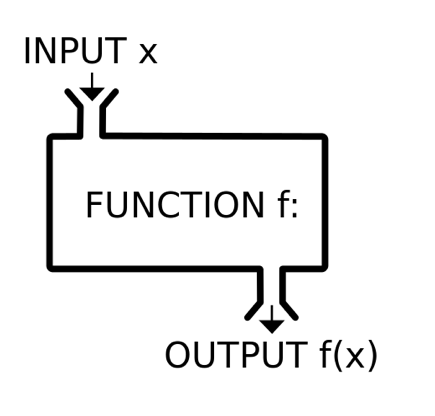
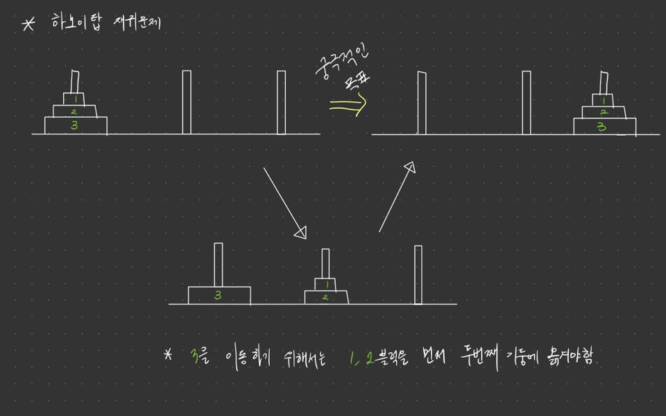

# 함수(Function)

> 특정한 기능(function)을 하는 코드의 묶음



---


## 함수를 쓰는 이유

- 높은 가독성 : 짧아짐
- 재사용성
- 유지보수 : 코드의 기능별 분화

---


## 함수의 선언과 호출

- 함수 선언은 `def`로 시작하여 `:`으로 끝나고, 다음은 `4spaces 들여쓰기`로 코드 블록을 만든다.

- 함수는 `매개변수(parameter)`를 넘겨줄 수도 있다.

- 함수는 동작후에 `return`을 통해 결과값을 전달 할 수도 있다. (`return` 값이 없으면, `None`을 반환한다.)

- 함수는 호출을 `func()` / `func(val1, val2)`와 같이 한다.


- **예시**

```python
# 세제곱 함수
def cube(x):
    return x ** 3

print(cube(2))
```

```
8
```


```python
# 사각형의 넓이를 구하는 함수
def rectangle(width, height):
    area = width * height
    perimeter = 2*(width + height)
    return area, perimeter

print(rectangle(30, 20))
print(rectangel(50, 70))
```

```
(600, 100)
(3500, 240)
```

---


## 내장 함수

- python에서 활용하는 print문도 파이썬에 지정된 함수이다.
- [파이썬 내장함수](https://docs.python.org/ko/3/library/functions.html)에서 내장함수 목록을 볼 수 있다.


- **예시**

```python
# 내장함수 max()를 사용해보자
max(1, 5)
```

```
5
```


```python
# my_max 함수를 작성해보자
def my_max(*param): # 가변 매개변수
    result = param[0]
    for i in param:
        if i > result:
            result = i
    return result

my_max(3, 2, 23, 13, 2, 17)
```

```
23
```

---


## 함수의 Output

- 앞서 언급한 바와 같이 함수는 반환되는 값이 있으며, 이때 그 값은 어떠한 종류라도 상관 없다.
- 단, **오직 한 개의 객체**만 반환된다.
  - return 1, 2 같이 여러개를 반환하는 것은 tuple 객체 **하나**를 반환하는 것이다.
  - 함수 내에서 return을 선언하지 않으면 None 객체가 반환된다.
- 함수가 return 되거나 종료되면, 함수를 호출한 곳으로 돌아간다.


- **예시**

```python
# 리스트를 두개 받아 각각 더한 결과를 비교하여 큰 리스트를 반환하라.
def my_list_max(list1, list2):
    if sum(list1) >= sum(list2): #내장함수 sum 사용
        return list1
    else:
        return list2
 
my_list_max([10, 3], [5, 9])
```

```
[5, 9]
```


```python
# return을 정의하지 않으면 어떤 것을 반환하는지 확인해보자
def hello(name):
    print(f'hello, {name}')
    
a = hello('jiyong')
print(a, type(a))
```

```
hello, jiyong
None <class 'NoneType'>
```


```python
# 여러개를 출력하는 것의 타입을 확인해보자
def tuple_func(x, y):
    return x+1, y+1

a = tuple_func(1, 2)
print(a, type(a))
```

```
(2, 3) <class 'tuple'>
```

---


## 함수의 입력(Input)

> 매개변수(parameter) & 인자(argument)
>
> 주로 혼용해서 사용하지만 엄밀하게 따지면 둘은 다르게 구분되어 사용된다.


### 매개변수(Parameter)

```python
def func(x):
    return x+1
```


- `x`는 매개변수
- 입력을 받아 함수 내부에서 활용할 변수라고 생각하면 된다.
- 함수의 정의 부분에서 볼 수 있다.


### 전달인자(argument)

```python
func(2)
```


- `2`는 인자이다.
- 실제로 전달되는 `입력값`이라고 생각하면 된다.
- 함수를 호출하는 부분에서 볼 수 있다.
- 함수는 기본적으로 인자를 `위치`로 판단한다.
  - `키워드 인자`로 직접 변수의 이름으로 특정 인자를 전달할 수 있다.
  - 그러나 `키워드 인자`를 활용한 다음에 `위치 인자`를 활용할 수 없다.


- **예시**

```python
# 원기둥의 부피
import math
def cylinder(radius, height):
    return round(radius**2*math.pi*height, 2)

print(cylinder(5,2))
print(cylinder(2,5)) # 순서를 바꾸면 다른 값이 나옵니다.
```

```
157.08
62.83
```


```python
# 인자를 전달할 때 매개변수를 지정하자
import math
def cylinder(radius, height):
    return round(radius**2*math.pi*height, 2) # 내장함수 round(반올림)

print(cylinder(5,2))
print(cylinder(height = 2, radius = 5)) # 같은 값이 나올 것입니다.
```

```
157.08
157.08
```


```python
# 키워드 변수 다음에 위치 변수 선언 불가능하다.
import math
def cylinder(radius, height):
    return round(radius**2*math.pi*height, 2) # 내장함수 round(반올림)

print(cylinder(height = 2, 5)) # syntaxerror
```

```
  File "<ipython-input-2-cbef59c8bb6d>", line 5
    print(cylinder(height = 2, 5))
                               ^
SyntaxError: positional argument follows keyword argument
```


```python
# 기본 인자 값 활용
def greeting(name = '익명'):
    print(f'{name}, 안녕')
    
greeting() # 오류가 일어나지 않는다.
```

```
익명, 안녕
```


#### 가변 인자 리스트(Arbitrary Argument Lists)

- `print()`처럼 개수가 정해지지 않은 임의의 인자를 바기 위해서는 가변 인자 리스트 `*args`를 활용한다.
- 가변 인자 리스트는 `tuple`형태로 처리가 되며, 매개변수에 `*`로 표현한다.

- 보통 가변 인자 리스트는 매개변수 목록의 마지막에 온다.
- 가변 인자 다음에 위치 인자를 선언하고자 한다면 `키워드 인자` 활용한다.


- **예시**

```python
def my_class(prof, *students):
    print(f'students의 타입은 {type(students)} 입니다.')
    for i in students:
        print(i)
    print(f'존경하는 {prof}교수님')
    
my_class('유창오', '김지용', '김싸피')
```

```
students의 타입은 <class 'tuple'> 입니다.
김지용
김싸피
존경하는 유창오교수님
```


```python
# 가변 인자 다음 위치 인자를 사용하자
def my_class(*students, prof):
    for i in students:
        print(i)
    print(f'존경하는 {prof}교수님')
    
my_class('김지용', '김싸피', prof = '유창오')
```

```
김지용
김싸피
존경하는 유창오교수님
```


#### 가변(임의) 키워드 인자(Arbitrary Keyword Arguments)

- 정해지지 않은 키워드 인자들은 **`dict`** 형태로 처리가 되며, `**`로 표현한다.

- 보통 `kwagrs`라는 이름을 사용하며, `**kwargs`를 통해 인자를 받아 처리할 수 있다.


- **예시**

```python
def my_dict(**kwargs):
    return kwargs

x = my_dict(한국어='안녕', 영어='hi', 독일어='Guten Tag')
print(type(x))
```

```
<class 'dict'>
```


```python
def say_hello(**kwargs):
    print("인사를 3개 국어로 말해봅시다.")
    for key, value in kwargs.items():
        print(f'{key}로는 \'{value}\' 입니다.')

say_hello(한국어='안녕', 영어='hi', 독일어='Guten Tag')
```

```
인사를 3개 국어로 말해봅시다.
한국어로는 '안녕' 입니다.
영어로는 'hi' 입니다.
독일어로는 'Guten Tag' 입니다.
```


```python
# url 생성기
def my_url(**kwargs):
    url = 'https://api.go.kr?'
    for key, value in kwargs.items():
        url += f'{key}={value}&'
    return url

url = my_url(sidoname='서울', key='asdf')
print(url)
```

```
https://api.go.kr?sidoname=서울&key=asdf&
```


## 함수와 스코프(scope)

> 함수는 코드 내부에 공간(scope)를 생성합니다. 함수로 생성된 공간은 `지역 스코프(local scope)`라고 불리며, 그 외의 공간인 `전역 스코프(global scope)`와 구분됩니다.


- **전역 스코프(`global scope`)**: 코드 어디에서든 참조할 수 있는 공간
- **지역 스코프(`local scope`)**: 함수가 만든 스코프로 함수 내부에서만 참조할 수 있는 공간

- **전역 변수(`global variable`)**: 전역 스코프에 정의된 변수
- **지역 변수(`local variable`)**: 로컬 스코프에 정의된 변수


### 이름 검색(resolution) 규칙

> 파이썬에서 사용되는 이름(식별자)들은 이름공간(namespace)에 저장되어 있다. 이것을, **`LEGB Rule`** 이라고 부르며, 아래와 같은 순서로 이름을 찾아나간다.


- `L`ocal scope: 정의된 함수

- `E`nclosed scope: 상위 함수

- `G`lobal scope: 함수 밖의 변수 혹은 import된 모듈
  - 로컬 스코프내에서 글로벌 변수를 변경하고자 한다면 변수 앞에 `global` 입력

- `B`uilt-in scope: 파이썬안에 내장되어 있는 함수 또는 속성


```python
# print 라는 이름으로 변수를 선언해보자
print = 5 # G
print(10) # B
```

```python
---------------------------------------------------------------------------
TypeError                                 Traceback (most recent call last)
<ipython-input-4-309de644a96c> in <module>
      1 print = 5
----> 2 print(10)

TypeError: 'int' object is not callable
```


```python
a = 1

def func(b):
    a = 2
    print(f'func에서 print : {a}')
    
func(a)    
print(f'전역 스코프에서 print : {a}')
```

```
func에서 print : 2
전역 스코프에서 print : 1
```


```python
a = 1

def func(b):
    global a
    a = 2
    print(f'func에서 print : {a}')
    
func(a)    
print(f'전역 스코프에서 print : {a}')
```

```
func에서 print : 2
전역 스코프에서 print : 2
```


### 변수의 수명주기(lifecycle)

> 변수의 이름은 각자의 `수명주기(lifecycle)`가 있다.


- **빌트인 스코프`(built-in scope)`**: 파이썬이 실행된 이후부터 영원히 유지

- **전역 스코프`(global scope)`**: 모듈이 호출된 시점 이후 혹은 이름 선언된 이후부터 인터프리터가 끝날때 까지 유지

- **지역(함수) 스코프`(local scope)`**: 함수가 호출될 때 생성되고, 함수가 가 종료될 때까지 유지 (함수 내에서 처리되지 않는 예외를 일으킬 때 삭제됨)


## 재귀 함수(recursive function)

> 재귀 함수는 함수 내부에서 자기 자신을 호출 하는 함수를 뜻합니다. 알고리즘을 설계 및 구현에서 유용하게 활용됩니다.


### 팩토리얼 계산

팩토리얼은 1부터 n 까지 양의 정수를 차례대로 곱한 값이며 `!` 기호로 표기합니다. 예를 들어 3!은 3 * 2 * 1이며 결과는 6 입니다.

`팩토리얼(factorial)`을 계산하는 함수 `fact(n)`를 작성하세요.

n은 1보다 큰 정수라고 가정하고, 팩토리얼을 계산한 값을 반환합니다.


```python
# 팩토리얼
def factorial(num):
    if num == 1 :
        return num
    else :
        return factorial(num-1) * num
    
print(factorial(5))
```

```
120
```


### 피보나치 수열

> 첫째 및 둘째 항이 1이며 그 뒤의 모든 항은 바로 앞 두 항의 합인 수열입니다.


~~피보나치 문제는 동적계획법(DP)에서 사용되지 않나..?~~


```python
# 피보나치
def fib(num):
    if num <= 2: # 첫째 둘째 항 1
        return 1
    else:
        return fib(num-2) + fib(num-1)
    
print(fib(6))
```

```
8
```


### 하노이 탑

> 개인적으로 재귀함수를 이해하게 된 문제로서 적고싶었다..
>
> 하노이 탑은 서로 다른 크기의 N개의 블럭과 3개의 기둥으로 구성되어져 있다.
>
> 이때 모든 블럭은 기둥 중 하나에 반드시 꽂혀야 하며, 자신보다 작은 블럭이 자신의 위에 꽂혀서는 안된다.


~~내가 그린 그림..~~




```python
# 하노이 탑
def move(block, fr, to):
    print(f'{block}번 블럭을 {fr}에서 {to}로 이동')

def hanoi(block, fr, by, to):
    if block == 1:
        move(block, fr, to)
    else:
        hanoi(block-1, fr, to, by)
        move(block, fr, to)
        hanoi(block-1, by, fr, to)
        
hanoi(3)
```

```
1번 블럭을 1에서 3로 이동
2번 블럭을 1에서 2로 이동
1번 블럭을 3에서 2로 이동
3번 블럭을 1에서 3로 이동
1번 블럭을 2에서 1로 이동
2번 블럭을 2에서 3로 이동
1번 블럭을 1에서 3로 이동
```

