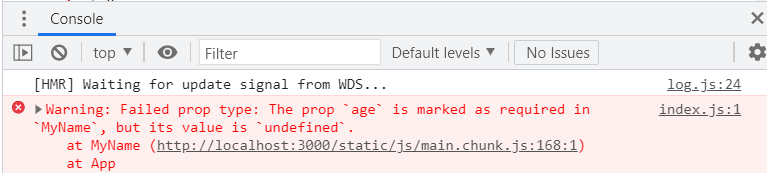

# 02. react

> props와 state

<br>

- 리액트 컴포넌트에서 다루는 데이터는 두개로 나뉩니다.
  - `props`
  - `state`

<br>

## props

<br>

### 새 컴포넌트 만들기

> MyName 이라는 컴포넌트를 만들어 보자.

<br>

```jsx
import React, { Component } from 'react';

class MyName extends Component {
  render() {
    return (
      <div>
        안녕하세요! 제 이름은 <b>{this.props.name}</b> 입니다.
      </div>
    );
  }
}

export default MyName;
```

```jsx
// App.js
import React, { Component } from 'react';
import MyName from './MyName';

class App extends Component {
  render() {
    return <MyName name="김지용" />;
  }
}

export default App;
```

- 자신이 받은 props value는 `this.` 키워드를 통해 조회할 수 있다.

<br>

---

<br>

### prop-types

> 프로퍼티의 자료형을 선언하는 방법은 리액트에서 제공하는 prop-types를 이용하면 된다.

프로퍼티는 자바스크립트의 자료형을 모두 사용할 수 있다. 이때 프로퍼티의 자료형을 미리 선언해주는 것이 좋다.

프로퍼티의 자료형을 미리 선언하면 리액트 엔진이 프로퍼티로 전달하는 값의 변화를 효율적으로 감지할 수 있고, 코드를 작성하는 개발자의 human error를 경고 메세지로 알려준다.

다음 코드는 객체형 프로퍼티를 가지는 컴포넌트이다.

```jsx
// MyName.jsx
import React, { Component } from 'react';
import PropTypes from 'prop-types'

class MyName extends Component {
    render() {
        return (
        	<div>
            	안녕하세요! 제 이름은 <b>{this.props.obj.name}</b> 입니다.
            </div>
        );
    }
}

// 자료형을 선언
MyName.propTypes = {
    name: PropTypes.object,
}

export default MyName;
```

```jsx
// App.js
import MyName from './components/MyName.jsx';

function App() {
  const propObj = {
    name: 'jiyong',
  }
  return (
    <div className="App">
      <MyName obj={propObj} />
    </div>
  );
}

export default App;

```

<br>

이외에도 다양한 프로퍼티를 사용할 수 있다.

- PropTypes.bool
- PropTypes.number
- PropTypes.arrayOf
- PropTypes.object
- PropTypes.node
- PropTypes.func

<br>

`isRequired`를 사용하여 필수 프로퍼티를 사용할 수 있습니다.

```jsx
// App.js
import MyName from './components/MyName.jsx';

function App() {
  return (
    <div className="App">
      <MyName name={"지용"} />
    </div>
  );
}

export default App;
```

```jsx
import React, { Component } from 'react';
import PropTypes from 'prop-types';

class MyName extends Component {
    render() {
        return (
            <div>
                안녕하세요! 제 이름은 <b>{this.props.name}</b> 입니다.
                <br/>
                나이는 <b>{this.props.age}</b>살 입니다.
            </div>
        );
    }
}

MyName.propTypes = {
    name: PropTypes.string,
    age: PropTypes.number.isRequired,
}

export default MyName;
```

- 결과 (오류)

  

<br>

### defaultProps

> 특정 상황에서나 실수로 props를 선언하지 않을 수 있다.
>
> 이러한 경우 default 값을 설정하여 default 값이 출력되게 할 수 있다.

<br>

```jsx
// MyName.jsx

import React, { Component } from 'react';

class MyName extends Component {
  static defaultProps = {
    name: '기본이름'
  }

  render() {
    return (
      <div>
        안녕하세요! 제 이름은 <b>{this.props.name}</b> 입니다.
      </div>
    );
  }
}

export default MyName;
```

```jsx
// App.js

import React, { Component } from 'react';
import MyName from './MyName';

class App extends Component {
  render() {
    return <MyName />;
  }
}

export default App;
```

<br>

---

<br>

### 함수형 컴포넌트

```jsx
// MyName.js
import React from 'react';

const MyName = ({ name }) => {
  return <div>안녕하세요 제 이름은 {name} 입니다.</div>;
};

MyName.defaultProps = {
  name: '지용이'
};

export default MyName;
```

- 코드 상단에서 `{ Component }` 를 import 할 필요 없다.
- `MyName` 은 **비구조화 할당 문법**
- 함수형 컴포넌트는 `state`와 `LifeCycle`이 빠져 있다.
  - 그래서 컴포넌트 초기 마운트가 아주 미세하게 빠르고, 메모리 자원을 덜 사용한다.
  - 컴포넌트를 무수히 많이 렌더링 하는게 아니라면 사실상 큰 차이 없다..

<br>

## state

> `props` 는 부모가 자식한테 내리고, 읽기 전용이다.
>
> `state`는 내부에서 변경 할 수 있다.
>
> 동적인 데이터를 다룰 때 사용한다.

<br>

```jsx
import React, { Component } from 'react';

class Counter extends Component {
    // state
    state = {
        number: 0
    }
	
	// 화살표 함수 사용
	handleIncrease = () => {
        this.setState({
            number = this.state.number + 1
        });
    }
    
    handleDecrease = () => {
        this.setState({
            number = this.state.number - 1
        });
    }
    
    render(){
        return (
        	<div>
            	<h1>카운터</h1>
                <div>값: {this.state.number}</div>
                <button onClick={this.handleIncrease}>+</button>
                <button onClick={this.handleDecrease}>-</button>
            </div>
        );
    }
}
```

- 컴포넌트의 state를 정의할 때는 `class fields` 문법을 사용한다.
- 만약 `constructor`를 작성했을 때는 Component를 상속해야 한다.
  - 기존의 클래스 생성자를 덮어쓰게 되므로..
- 컴포넌트의 메서드는 `화살표 함수`로 작성해야 한다.
  - 그렇지 않으면 `this`와의 연결이 끊겨버린다..
  - 물론 연결 해주는 방법은 있다..!

<br>

```jsx
class Counter extends Component{
    state = {
        number: 0
    };
	
	// constructor 사용
	constructor(props) {
        super(props);
        // bind(연결) 해주기
        this.handleIncrease = this.handleIncrease.bind(this);
        this.handleDecrease = this.handleDecrease.bind(this);
    }
	
	handleIncrease(){
        this.setState({
            number = this.state.number + 1
        });
    }
    
    handleDecrease(){
        this.setState({
            number = this.state.number - 1
        });
    }
}
```


<br>

### setState

> state 값을 바꾸기 위해서는  setState를 무조건 거쳐야 한다.

state값을 직접 변경하면 안되는 이유는 render() 함수로 화면을 그려주는 시점은 리액트 엔진이 정하기 때문이다. 즉, state를 직접 변경하더라도 render() 함수는 새로 호출되지 않는다. 하지만 `setState()` 함수를 호출하여 state 값을 변경하면 리액트 엔진이 자동으로 render() 함수를 호출하므로 화면에 변경된 state 값을 새롭게 출력할 수 있다.

실제로 `setState()`함수로 state 값을 변경하면 몇 단계의 검증 과정을 거쳐 render() 함수를 호출한다.

<br>

```jsx
state = {
    number: 0;
}

this.setState({
    number: this.state.number + 1
});
```

<br>

- **!!주의할 점!!**
- `setState`는 객체의 깊은 곳까지 들어가지 않는다.

```jsx
state = {
    number: 0,
    foo: {
      bar: 0,
      foobar: 1
    }
}

this.setState({
  foo: {
    foobar: 2
  }
})
```

- 위와 같이 하게 되면 **foo 객체 자체가 변경된다.**
- 따라서 다음과 같이 해주어야 한다.

```jsx
this.setState({
  number: 0,
  foo: {
    ...this.state.foo,
    foobar: 2
  }
});
```

- `...` 은 자바스크립트의 **전개연산자** 이다.
  - 객체안의 내용을 작성된 위치에 풀어준다는 의미!!


<br>

- `비구조화 할당`으로 작성하기
  - 좀 더 멋진 문법으로 작성해본다..
- setState() 함수의 인자로 함수를 전달하면 이전 state 값을 따로 읽는 과정을 생략할 수 있다.

```jsx
handleIncrease = () => {
    const { number } = this.state;
    this.setState({
        number: number + 1
    });
}

handleDecrease = () => {
    this.setState(
        /*
        (state) => ({
        	number: state.number - 1
        })
        */
    	({number}) => ({
            number: number - 1
        })
    );
}
```

<br>

- 이벤트이름을 설정할 때 **camelCase**로 설정해야 한다.
  - `onclick : onClick`
  - `onmousedown : onMouseDown`
  - ...

<br>


