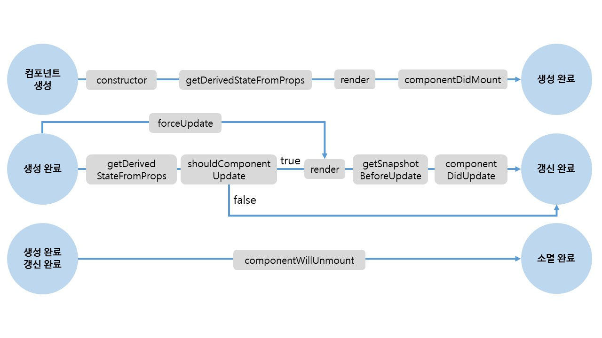
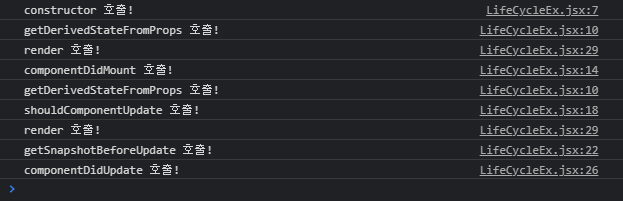

# LifeCycle API

> 컴포넌트가 브라우저에서 나타날 때, 사라질 때, 업데이트 될 떄, 호출되는 API



- `Mounting` : 컴포넌트가 브라우저에 나타날 때
- `Updating` : 컴포넌트의 props 나 state가 바뀌었을 때
- `Unmounting` : 컴포넌트가 없어질 때

<br>

##  컴포넌트 초기 생성

> 컴포넌트가 브라우저에 나타나기 전, 후에 호출되는 API

<br>

### Constructor

```javascript
constructor(props) {
    super(props)
}
```

- 컴포넌트 생성자 함수 - 컴포넌트가 새로 만들어질 때마다 이 함수가 호출된다.

<br>

### componentDidMount

```javascript
componentDidMount() {
  // 외부 라이브러리 연동: D3, masonry, etc
  // 컴포넌트에서 필요한 데이터 요청: Ajax, GraphQL, etc
  // DOM 에 관련된 작업: 스크롤 설정, 크기 읽어오기 등
}
```

- 컴포넌트가 화면에 나타나게 됐을 때 호출된다.
- DOM을 사용해야하는 외부 라이브러리 연동
- 해당 컴포넌트에서 필요한 데이터를 요청하기 위해 axios, fetch 등을 통하여 ajax 요청을 하거나, DOM 의 속성을 읽거나 직접 변경하는 작업을 진행한다.

<br>

---

<br>

## 컴포넌트 업데이트

> 컴포넌트 업데이트는 props의 변화, state의 변화에 따라 결정된다.

<br>


### static getDerivedStateFromProps(props, state)

props로 받아온 값은 state로 동기화 하는 작업을 해줘야 하는 경우 사용된다.

`getDerivedStateFromProps()` 함수는 정적 함수이다. 따라서 함수 안에서 **this.props나 this.state**로 state와 props에 접근할 수 없다. 만약 각 값에 접근해야 하는 경우 반드시 인자로 전달된 **props, state**를 이용해야 한다.

이 함수는 상위 컴포넌트에서 전달받은 프로퍼티로 state 값을 연동할 때 주로 사용하며, 반환값으로 state를 변경한다.

```javascript
static getDerivedStateFromProps(nextProps, prevState) {
  // 여기서는 setState 를 하는 것이 아니라
  // 특정 props 가 바뀔 때 설정하고 싶은 state 값을 리턴하는 형태로
  // 사용됩니다.
  /*
  if (nextProps.value !== prevState.value) {
    return { value: nextProps.value };
  }
  return null; // null 을 리턴하면 따로 업데이트 할 것은 없다라는 의미
  */
}
```

<br>

### shouldComponentUpdate(nextProps, nextState)

```javascript
shouldComponentUpdate(nextProps, nextState) {
  // return false 하면 업데이트를 안함
  // return this.props.checked !== nextProps.checked
  return true;
}
```

- 컴포넌트를 최적화하는 작업에서 유용하게 사용된다.
- 리액트에서는 **변화가 발생하는 부분**만 업데이트를 해줘서 성능이 좋다.
- 하지만, 변화가 발생한 부분만 감지하기 위해서는 Virtual DOM에 한번 그려줘야한다.
- CPU 처리량을 줄여주기 위해서 Virtual DOM에 리렌더링 하는 것도 방지하기 위해서는 `shoudComponentUpdate`를 작성해야 한다.
  - 리액트 성능에 영향을 많이 준다.
- 화면 변경을 위해 검증 작업을 하는 경우 이 함수를 사용한다.


<br>


### getSnapshotBeforeUpdate(prevProps, prevState)

**실제 DOM 변화가 일어나기 직전의 DOM 상태를 가져오고**, 여기서 return 하는 값은 `componentDidUpdate` 에서 3번째 파라미터로 받아올 수 있게 된다.

출력될 엘리먼트의 크기 또는 스크롤 위치 등의 DOM 정보에 접근할 때 사용됩니다.

```javascript
getSnapshotBeforeUpdate(prevProps, prevState) {
    // DOM 업데이트가 일어나기 직전의 시점입니다.
    // 새 데이터가 상단에 추가되어도 스크롤바를 유지해보겠습니다.
    // scrollHeight 는 전 후를 비교해서 스크롤 위치를 설정하기 위함이고,
    // scrollTop 은, 이 기능이 크롬에 이미 구현이 되어있는데, 
    // 이미 구현이 되어있다면 처리하지 않도록 하기 위함입니다.
    if (prevState.array !== this.state.array) {
        const {
            scrollTop, scrollHeight
        } = this.list;
        
        return {
            scrollTop, scrollHeight
        };
    }
}
componentDidUpdate(prevProps, prevState, snapshot) {
    if (snapshot) {
      const { scrollTop } = this.list;
      if (scrollTop !== snapshot.scrollTop) return; // 기능이 이미 구현되어있다면 처리하지 않습니다.
      const diff = this.list.scrollHeight - snapshot.scrollHeight;
      this.list.scrollTop += diff;
    }
}
```

<br>

### componentDidUpdate(prevProps, prevState, snapshot)

컴포넌트에서 render() 를 호출하고난 다음에 발생한다.

이전 프로퍼티와 이전 state값과 함께 **getSnapshotBeforeUpdate()** 함수에서 반환된 값을 인자로 전달받습니다. 이 값들을 이용하여 스크롤 위치를 옮기거나 커서를 이동시키는 등의 DOM 정보를 변경할 때 사용됩니다.

<br>

---

<br>

## 컴포넌트 제거

> componentWillUnmount 하나 존재

<br>

### componentWillUnmount

```javascript
componentWillUnmount() {
  // 이벤트, setTimeout, 외부 라이브러리 인스턴스 제거
}
```

- 등록했었던 이벤트 제거
- 외부 라이브러리 인스턴스 제거

<br>

---

<br>

## 컴포넌트에 에러 발생

render 함수에서 에러가 발생한다면, 리액트 앱이 크래쉬 되어버린다. 이러한 상황에서 유용하게 사용할 수 있는 API

<br>

### componentDidCatch

```javascript
componentDidCatch(error, info) {
  this.setState({
    error: true
  });
  // API를 통해서 서버로 에러 내용 날리기
}
```

- 컴포넌트 자신이 에러가 발생하는 것을 잡을 수 없다.
- 컴포넌트의 부모가 발생하는 에러를 잡아내므로 부모에 선언해준다.
- `error` : 어떤 error가 발생했는지
- `info` : 어디서 error가 발생했는지


<br>

## 실험

> 생명주기 함수의 실행 과정을 살펴보자

```jsx
// ./components/LifeCycleEx.jsx
import React, { Component } from 'react';

class LifeCycleEx extends Component {
  constructor(props) {
    super(props);
    this.state = {};
    console.log('constructor 호출!');
  }
  static getDerivedStateFromProps() {
    console.log('getDerivedStateFromProps 호출!');
    return {};
  }
  componentDidMount() {
    console.log('componentDidMount 호출!');
    this.setState({updated: true});
  }
  shouldComponentUpdate() {
    console.log('shouldComponentUpdate 호출!');
    return true;
  }
  getSnapshotBeforeUpdate() {
    console.log('getSnapshotBeforeUpdate 호출!')
    return {}
  }
  componentDidUpdate() {
    console.log('componentDidUpdate 호출!')
  }
  render() {
    console.log('render 호출!');
    return (
      <div>
        
      </div>
    );
  }
}

export default LifeCycleEx;
```

<br>

```javascript
// App.js
import LifeCycleEx from "./components/LifeCycleEx";

function App() {
  return (
    <div className="App">
      <LifeCycleEx />
    </div>
  );
}

export default App;
```

<br>

- 결과

  