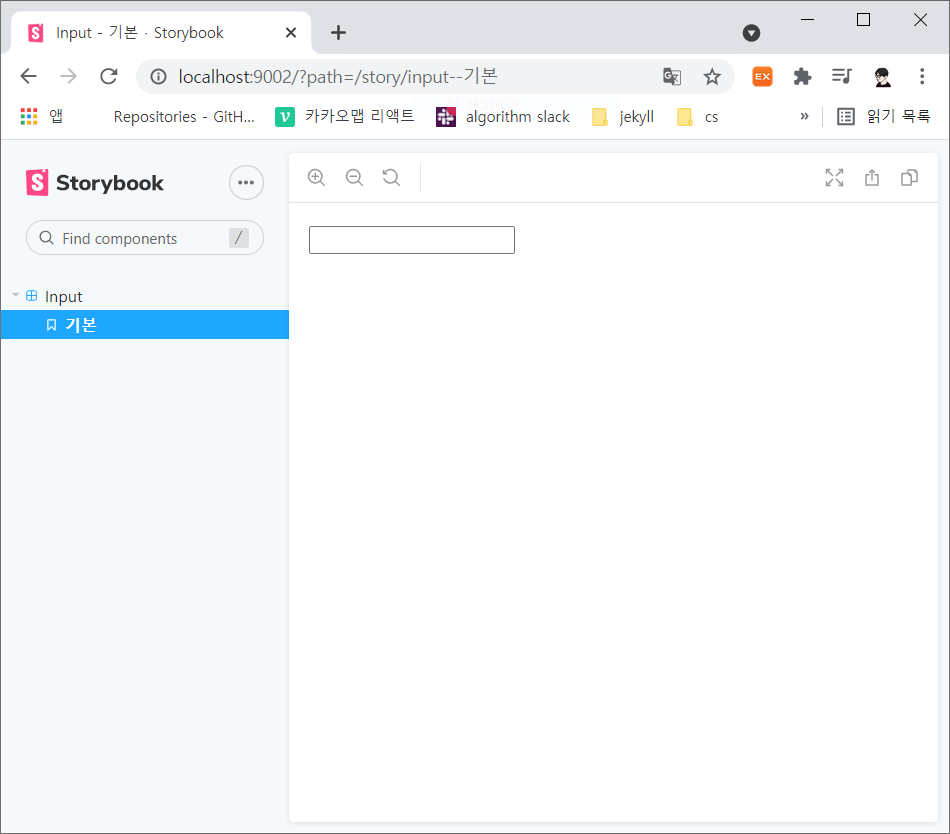
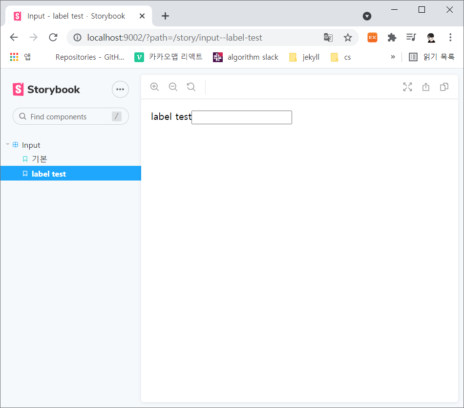
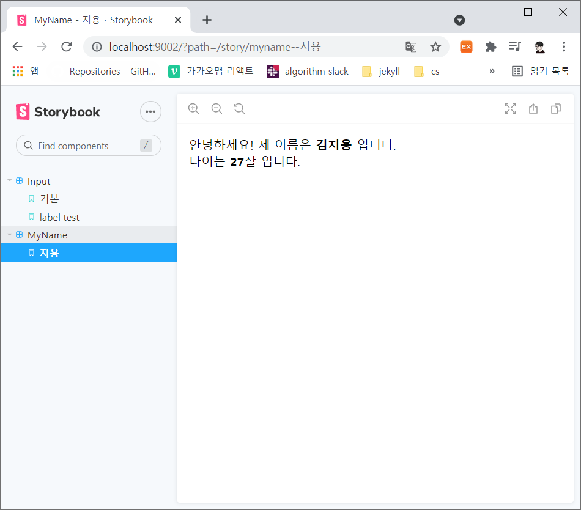
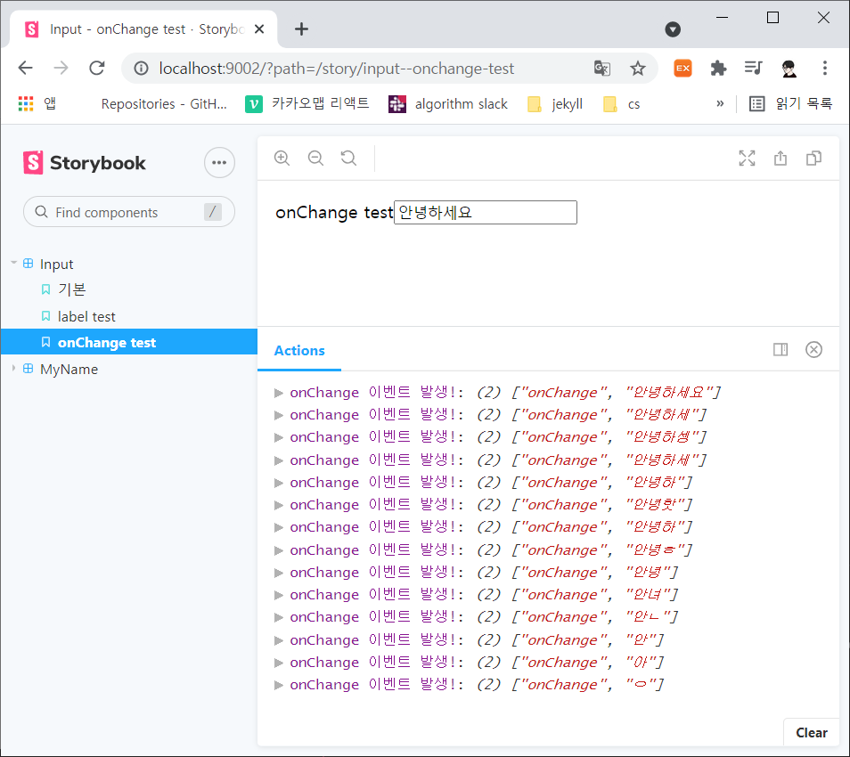

# [react] storybook

<br>

대부분의 웹 사이트는 상황에 따라 오류메시지나 로딩 화면을 출력한다. 이런 화면들은 상황에 따라 출력되는 것으로 최소 2개의 화면을 구성해야 한다. 따라서 상황에 맞게 컴포넌트를 제작하고 확인하는 작업은 번거로울 수 있다.

**스토리북**이라는 비주얼 테스트 도구를 사용하여 화면을 구성하는 컴포넌트들을 독립적으로 관리하고 변화를 살펴볼 수 있다.

<br>

## 1. 스토리북 설치 및 사용

- 스토리북 설치

  ```bash
  $ npm i -D @storybook/react
  ```

- package.json에 명령어 추가

  ```json
  {
      ...
      "scripts": {
          "storybook": "start-storybook -p 9001 -c .storybook",
          ...
      }
  }
  ```

  - 9001 포트를 통해 서버를 실행시킨다.

- 스토리 파일 만들기

  ```jsx
  // ./src/stories/InputStory.jsx
  import React from 'react';
  import { storiesOf } from '@storybook/react';
  
  // 직접 만든 Input 컴포넌트
  import Input from '../components/Input';
  
  storiesOf('Input', module).add('기본', () => <Input name="name"/>);
  ```

- 스토리북 `config.js`에 스토리 연결

  - 위에서 만든 스토리를 스토리북 `config.js`에 연결한다.
  - 스토리를 스토리북에 연결하려면 프로젝트 루트 폴더에 `.storybook`이라는 폴더가 필요하다.

  ```javascript
  // ./.storybook/config.js
  import { configure } from '@storybook/react';
  
  function loadStories() {
      // 연결
      require('../src/stories/InputStory');
  }
  
  configure(loadStories, module);
  ```

- 스토리북 실행

  - 이전에 추가한 명령어를 통해 storybook을 실행한다

  ```bash
  $ npm run storybook
  ```

- 결과

  

<br>

## 2. 스토리 다른 형태로 추가하기

<br>

### 다른 형태 컴포넌트 추가

Input 컴포넌트에 **label** 속성을 추가한 컴포넌트를 추가한다.

- 스토리 추가

  ```jsx
  // ./src/stories/InputStory.jsx
  import React from 'react';
  import { storiesOf } from '@storybook/react';
  
  // 직접 만든 Input 컴포넌트
  import Input from '../components/Input';
  
  storiesOf('Input', module)
      .add('기본', () => <Input name="name"/>)
      .add('label test', () => <Input name="label" label="label test" />);
  ```

- 결과

  

<br>

### 새 스토리 추가해보기

새로운 스토리를 추가한다.

- 스토리 생성

  ```jsx
  // ./src/stories/NameStory.jsx
  import React from 'react';
  import { storiesOf } from '@storybook/react';
  
  import MyName from '../components/MyName';
  
  storiesOf('MyName', module).add('지용', () => <MyName name="지용" age="27" />)
  ```

- 스토리북에 스토리 연결하기

  ```javascript
  // ./.storybook/config.js
  import { configure } from '@storybook/react';
  
  function loadStories() {
      require('../src/stories/InputStory');
      require('../src/stories/NameStory');
  }
  
  configure(loadStories, module);
  ```

- 결과

  

<br>

### 자동화

앞으로 많은 스토리를 생성할 예정인데, 그때마다 `config.js`를 수정하는 것은 번거로운 작업이다.

자동으로 스토리가 스토리북에 추가될 수 있도록 `config.js`를 수정한다.

```javascript
// ./.storybook/config.js
import { configure } from '@storybook/react';
import interopRequireDefault from 'babel-runtime/helpers/interopRequireDefault';

function loadStories() {
    // 스토리 목록을 가져온다.
    const context = require.context('../src/stories', true, /Story\.jsx$/);
    
    context.keys().forEach((srcFile) => {
        interopRequireDefault(context(srcFile));
    });
}

configure(loadStories, module);
```

<br>

## 3. 확장 도구 사용하기

> addon-actions
>
> addon-jsx

<br>

### addon-actions

addon-actions는 스토리북에서 발생하는 특정 이벤트에 로그를 출력하게 해준다.

- 설치하기

  ```bash
  $ npm i -D @storybook/addons @storybook/addon-actions
  ```

- 설정 추가하기

  - 스토리북이 확장 도구를 인식할 수 있도록 설정한다.
  - `.storybook` 폴더에 **addons.js**를 추가한다.

  ```javascript
  // ./.storybook/addons.js
  import '@storybook/addon-actions/register';
  ```

- addon-actions 적용하기

  - 이전에 만든 input의 value가 변경될 때마다 전달한 콜백 함수를 실행한다.

  ```jsx
  // ./src/stories/InputStory
  import React from 'react';
  import { storiesOf } from '@storybook/react';
  import { action } from '@storybook/addon-actions';
  
  import Input from '../components/Input';
  
  storiesOf('Input', module)
  	.add('기본', () => <Input name="name"/>)
      .add('label test', () => <Input name="label" label="label test"/>)
      .add('onChange test', () => <Input name="onChange" label="onChange test" onChange={action('onChange 이벤트 발생!')} />);
  ```

- 결과

  

<br>

### addon-jsx

addon-jsx는 스토리북에서 JSX코드를 확인할 수 있도록 해주는 확장 도구이다.

- 설치하기

  ```bash
  $ npm i -D storybook-addon-jsx
  ```

- 설정 추가하기

  - 스토리북이 인지할 수 있도록 설정을 추가한다.

  ```javascript
  // ./.storybook/addons.js
  import '@storybook/addon-actions/register';
  // jsx 추가
  import 'storybook-addon-jsx/register';
  ```

- `config.js` 수정하기

  ```javascript
  import { configure, setAddon } from '@storybook/react';
  import interopRequireDefault from 'babel-runtime/helpers/interopRequireDefault';
  import JSXAddon from 'storybook-addon-jsx';
  
  function loadStories() {
      const context = require.context('../src/stories', true, /Story\.jsx$/);
      
      context.keys().forEach((srcFile) => {
          interopRequireDefault(context(srcFile));
      });
  }
  
  setAddon(JSXAddon);
  configure(loadStories, module);
  ```

- 스토리 수정

  - addon-jsx를 통해 JSX를 보려면 add() 함수가 아닌 **addWithJSX()** 함수를 사용행 한다.

  ```jsx
  import React from 'react';
  import { storiesOf } from '@storybook/react';
  import { action } from '@storybook/addon-actions';
  
  import Input from '../components/Input';
  
  storiesOf('Input', module)
  	.addWithJSX('기본', () => <Input name="name"/>)
      .addWithJSX('label test', () => <Input name="label" label="label test"/>)
      .addWithJSX('onChange test', () => <Input name="onChange" label="onChange test" onChange={action('onChange 이벤트 발생!')} />);
  ```

