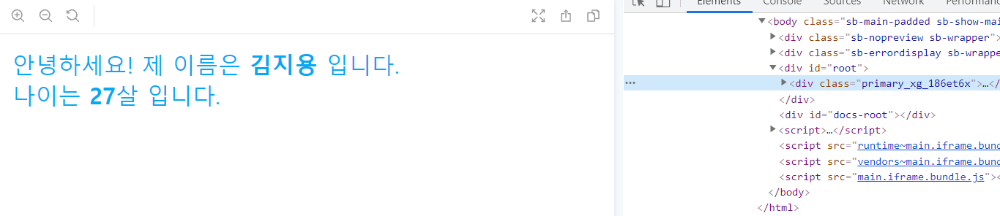

# [react] style component

<br>

## 0. 배경

스타일 파일을 사용하면 내려받은 파일에 의존하므로 컴포넌트를 공유할 때 별도의 스타일 파일을 공유해야 한다는 단점이 있다. 그리고 CSS 방식은 스타일 관리도 어렵다.

만약 프로젝트의 규모가 커지면 css 선택자의 길이가 매우 커지면서 스타일 정의 이름만으로도 상당한 용량을 차지하게 된다.

```css
.container > .box > .ul > .title ... {
    font-size: 1.5rem;
}
```

이러한 문제점을 해결하기 위해 컴포넌트 파일과 함께 컴포넌트에만 적용되는 스타일을 결합하는 컴포넌트 개발법(CSS-in-JS)이 등장했다. 스타일 컴포넌트는 클래스의 이름을 a123wrs와 같이 짧게 변환해 준다. 덕분에 CSS 방식보다 적은 용량으로 스타일 파일을 관리할 수 있다.

**react-with-styles**를 사용한다.

<br>

## 1. react-with-styles

react-with-styles는 에어비엔비에서 공개한 스타일 컴포넌트 라이브러리이다.

react-with-styles외에 서버 출력을 도와주는 아프로디테(Aphrodite)도 설치한다. 자바스크립트로 스타일을 적용하면 **화면이 모두 출력된 이후 자바스크립트 엔진이 동작하며 적용하게 되므로 스타일 적용까지 시간 간격**이 생기게 된다. 이로 인해 **왜곡된 화면이 노출**될 수 있으므로 화면 출력을 시작하는 순간에 스타일 코드를 서버에서 생성하여 같이 출력하도록 **서버 출력**을 실시한다.

- 설치하기

  ```bash
  $ npm i react-with-styles aphrodite react-with-styles-interface-aphrodite
  ```

- 테마 파일 만들기

  - 프로젝트 전체에서 사용할 스타일 파일을 만든다.

  ```javascript
  // ./src/Theme.js
  export default {
      color: {
          primary: '#03a9f4',
          secondary: '#795548',
          white: '#FFFFFF',
          gray: '#CCCCCC',
          default: '#999999',
      },
      size: {
          xg: 25,
          lg: 18,
          md: 14,
          sm: 12,
          xs: 10,
      },
      lineHeight: {
          xg: '60px',
          lg: '54px',
          md: '36px',
          sm: '24px',
          xs: '18px',
      },
      unit: 4,
  };
  ```

- 공용 스타일 컴포넌트 함수 만들기

  - 공용 파일을 만들어 설정한다.
  - 앞에서 정의한 테마 파일을 등록한 후, 공통된 테마 설정값을 사용하여 스타일 컴포넌트를 구성한다.

  ```javascript
  // ./src/withStyles.js
  
  // 1. react-with-styles의 테마 관리자를 import
  import ThemeStyleSheet from 'react-with-styles/lib/ThemeStyleSheet';
  
  // 2. 서버 출력을 위한 아프로디테 라이브러리의 react-with-styles 버전을 import
  import aphroditeInterface from 'react-with-styles-interface-aphrodite';
  
  // 3. react-with-styles에서 사용하는 함수를 import
  import { css, withStyles, withStylesPropTypes } from 'react-with-styles';
  
  import Theme from './Theme';
  
  // 4. 테마 등록
  ThemeStyleSheet.registerTheme(Theme);
  
  // 5. 아프로디테를 적용
  ThemeStyleSheet.registerInterface(aphroditeInterface);
  
  export { css, withStyles, withStylesPropTypes, ThemeStyleSheet };
  export default withStyles;
  ```

- MyName 컴포넌트에 스타일 적용하기

  ```jsx
  // ./src/components/MyName.jsx
  import React, { Component } from 'react';
  import PropTypes from 'prop-types';
  import withStyles, { css } from '../withStyles';
  
  class MyName extends Component {
      render() {
          const { styles, name, age } = this.props;
          return (
              <div {...css(styles.primary_xg)}>
                  안녕하세요! 제 이름은 <b>{name}</b> 입니다.
                  <br/>
                  나이는 <b>{age}</b>살 입니다.
              </div>
          );
      }
  }
  
  MyName.PropTypes = {
      name: PropTypes.string.isRequired,
      age: PropTypes.string.isRequired,
  }
  
  export default withStyles(({ color, size }) => ({
      primary_xg: {
          color: color.primary,
          fontSize: size.xg,
      }
  }))(MyName);
  ```

- 결과

  

 
