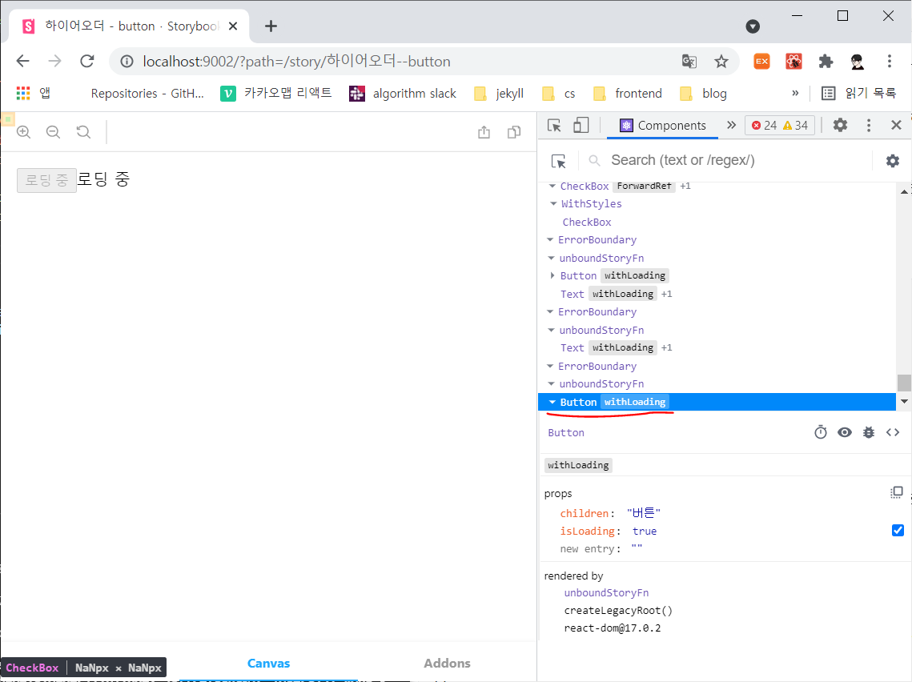

# [react] 하이어오더 컴포넌트

> 기존 컴포넌트의 기능을 확장하는 방법에 대해 알아보자.

<br>

## 0. 상속 패턴과 데코레이터 패턴

클래스의 특징 중 하나가 상속 패턴이다. 상속 패턴을 활용하여 클래스 컴포넌트를 확장하면 특정 기능 코드를 공유하고 서로 다른 기능을 갖는 클래스 컴포넌트를 구현할 수 있다.

하지만 상속 패턴에는 구조적으로 문제점을 가지고 있다.

- 부모에 구현된 항목을 한눈에 파악하기 어렵다.
- 원치 않는 기능을 물려받아야 한다.

상속 관계간의 종속성을 없애고 원하는 기능만 공유받는 것이 바로 **데코레이터 패턴**이다.

함수형 코드에서는 이와 같은 기능을 구현하기 위해 **커링** 패턴을 응용하여 코차 함수를 사용해 구현한다.

**하이어오더 컴포넌트**는 고차 함수 확장기능을 리액트 컴포넌트에서 구현할 수 있도록 고안한 디자인 패턴이다.

<br>

<br>

## 1. 구현 방법

하이어오더 컴포넌트의 구현 방법은 고차 함수구조와 동일하다.

```jsx
import React from 'react';

// 함수형 컴포넌트 반환
export default function withHOC(WrappedComponent) {
    return function WithHOC(props) {
        return <WrappedComponent {...props} />;
    }
}

// 클래스 컴포넌트 반환
export default function withHOC(WrappedComponent) {
    return class WithHOC extends React.Component {
        render() {
            return <WrappedComponent {...this.props} />;
        }
    }
}
```

- 인자로 컴포넌트를 전달받아 새로운 컴포넌트를 전달한다.
- 클래스 컴포넌트, 함수형 컴포넌트 상관 없이 반환한다.
- 프로퍼티는 **전개 연산자** 표현식을 사용하여 확장된 컴포넌트에 전달한다.
- 하이어오터 컴포넌트 이름은 `with`로 시작하는 것이 국룰..
  - 기존 컴포넌트, 함수와 구분짓기 위해서..

<br>

<br>

## 2. 예제

> 로딩 표시 화면 하이어오더 컴포넌트 만들기

- `withLoading.jsx`

  ```jsx
  import React from 'react';
  
  export default function (message="로딩 중") {
      return function withLoading(WrappedComponent) {
          const { displayName, name: componentName } = WrappedComponent;
          const wrappedComponentName = displayName || componentName;
          
          function WithLoading({ isLoading, ...otherProps }) {
              if (isLoading) return message;
              return (
              	<WrappedComponent {...otherProps}/>
              );
          }
          WithLoading.displayName = `withLoading(${wrappedComponentName})`;
          return WithLoading;
      }
  }
  ```

  - 리액트 도구에서 서로 다른 이름의 확장 컴포넌트가 같은 이름으로 출력되지 않게 하기 위해 `displayName` 설정
  - 하이어오더 컴포넌트를 만들 때 암묵적으로 **인자 하나만 전달**해야하는 규칙이 있다.
    - **다중 커링**을 활용
  - 로딩 중(`isLoading`) 이라면 인자로 전달 받은 `message(default는 로딩 중)`를 출력하고 아니라면 원래의 컴포넌트를 반환한다.

- `MyStory.jsx`

  ```jsx
  // ./src/stories/MyStory.jsx
  import React from 'react';
  import { storiesOf } from '@storybook/react';
  
  import Text from '../components/Text';
  import Button from '../components/Button';
  import withLoading from '../components/withLoading';
  
  const TextWithLoading = withLoading()(Text);
  const ButtonWithLoading = withLoading(<Button disabled>로딩 중</Button>)(Button);
  
  storiesOf('하이어오더', module)
  .add('button', () => (
      <div>
          <ButtonWithLoading isLoading>버튼</ButtonWithLoading>
          <TextWithLoading isLoading>안녕하세요</TextWithLoading>
      </div>
  ))
  ```

- 결과

  