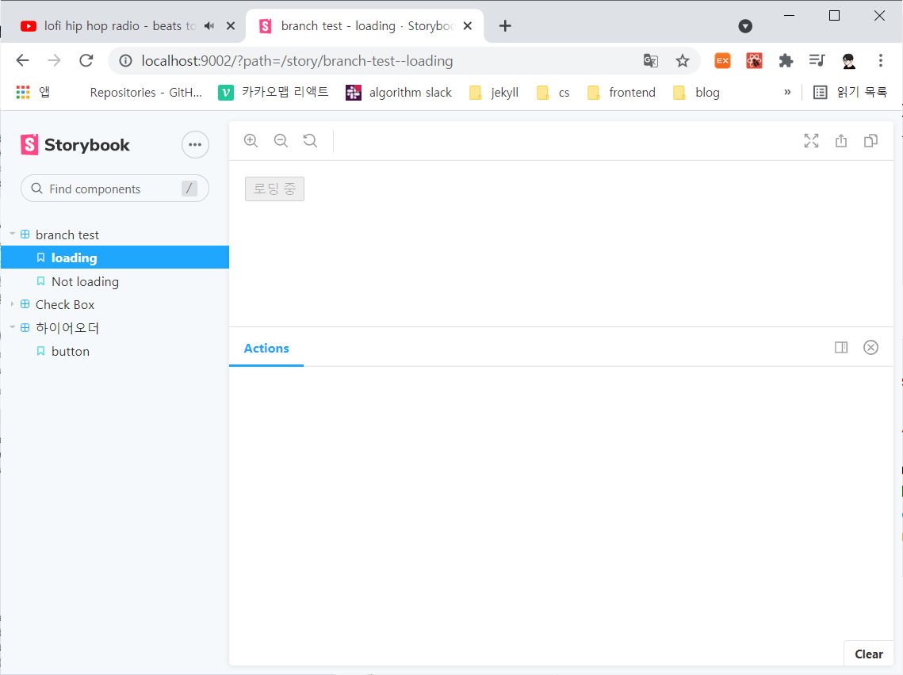
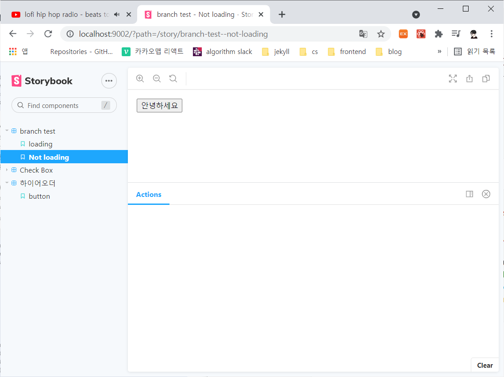
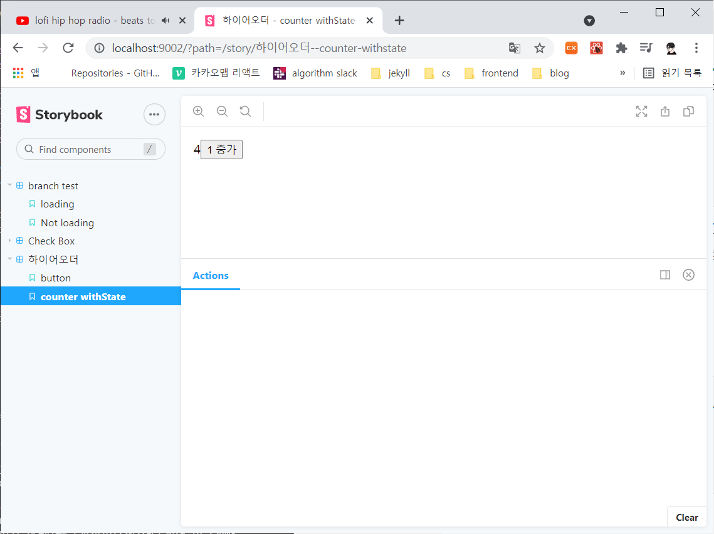

# [react] 하이어오더 컴포넌트

> 기존 컴포넌트의 기능을 확장하는 방법에 대해 알아보자.

<br>

## 0. 상속 패턴과 데코레이터 패턴

클래스의 특징 중 하나가 상속 패턴이다. 상속 패턴을 활용하여 클래스 컴포넌트를 확장하면 특정 기능 코드를 공유하고 서로 다른 기능을 갖는 클래스 컴포넌트를 구현할 수 있다.

하지만 상속 패턴에는 구조적으로 문제점을 가지고 있다.

- 부모에 구현된 항목을 한눈에 파악하기 어렵다.
- 원치 않는 기능을 물려받아야 한다.

상속 관계간의 종속성을 없애고 원하는 기능만 공유받는 것이 바로 **데코레이터 패턴**이다.

함수형 코드에서는 이와 같은 기능을 구현하기 위해 **커링** 패턴을 응용하여 코차 함수를 사용해 구현한다.

**하이어오더 컴포넌트**는 고차 함수 확장기능을 리액트 컴포넌트에서 구현할 수 있도록 고안한 디자인 패턴이다.

<br>

<br>

## 1. 구현 방법

하이어오더 컴포넌트의 구현 방법은 고차 함수구조와 동일하다.

```jsx
import React from 'react';

// 함수형 컴포넌트 반환
export default function withHOC(WrappedComponent) {
    return function WithHOC(props) {
        return <WrappedComponent {...props} />;
    }
}

// 클래스 컴포넌트 반환
export default function withHOC(WrappedComponent) {
    return class WithHOC extends React.Component {
        render() {
            return <WrappedComponent {...this.props} />;
        }
    }
}
```

- 인자로 컴포넌트를 전달받아 새로운 컴포넌트를 전달한다.
- 클래스 컴포넌트, 함수형 컴포넌트 상관 없이 반환한다.
- 프로퍼티는 **전개 연산자** 표현식을 사용하여 확장된 컴포넌트에 전달한다.
- 하이어오터 컴포넌트 이름은 `with`로 시작하는 것이 국룰..
  - 기존 컴포넌트, 함수와 구분짓기 위해서..

<br>

<br>

## 2. 예제

> 로딩 표시 화면 하이어오더 컴포넌트 만들기

- `withLoading.jsx`

  ```jsx
  import React from 'react';
  
  export default function (message="로딩 중") {
      return function withLoading(WrappedComponent) {
          const { displayName, name: componentName } = WrappedComponent;
          const wrappedComponentName = displayName || componentName;
          
          function WithLoading({ isLoading, ...otherProps }) {
              if (isLoading) return message;
              return (
              	<WrappedComponent {...otherProps}/>
              );
          }
          WithLoading.displayName = `withLoading(${wrappedComponentName})`;
          return WithLoading;
      }
  }
  ```

  - 리액트 도구에서 서로 다른 이름의 확장 컴포넌트가 같은 이름으로 출력되지 않게 하기 위해 `displayName` 설정
  - 하이어오더 컴포넌트를 만들 때 암묵적으로 **인자 하나만 전달**해야하는 규칙이 있다.
    - **다중 커링**을 활용
  - 로딩 중(`isLoading`) 이라면 인자로 전달 받은 `message(default는 로딩 중)`를 출력하고 아니라면 원래의 컴포넌트를 반환한다.

- `MyStory.jsx`

  ```jsx
  // ./src/stories/MyStory.jsx
  import React from 'react';
  import { storiesOf } from '@storybook/react';
  
  import Text from '../components/Text';
  import Button from '../components/Button';
  import withLoading from '../components/withLoading';
  
  const TextWithLoading = withLoading()(Text);
  const ButtonWithLoading = withLoading(<Button disabled>로딩 중</Button>)(Button);
  
  storiesOf('하이어오더', module)
  .add('button', () => (
      <div>
          <ButtonWithLoading isLoading>버튼</ButtonWithLoading>
          <TextWithLoading isLoading>안녕하세요</TextWithLoading>
      </div>
  ))
  ```

- 결과

  

<br>

<br>

## 3. 하이어오더 컴포넌트 라이브러리

`recompose`라이브러리는 자주 사용되는 패턴의 하이어오더 컴포넌트를 모아둔 라이브러리이다.

`recompose`를 사용하면서 함수형 컴포넌트의 확장기능을 이해해보자.

- 라이브러리 다운로드

  ```bash
  $ npm i recompose
  ```

<br>

### branch

`branch()`함수를 통해 조건에 따라 컴포넌트를 렌더링 할 수 있다.

- 기본 구현 방법

  ```jsx
  import branch from 'recompose/branch'
  
  branch(
      condition: props => boolean,
      left: HigherOrderComponent
      [right: HigherOrderComponent]
  )(WrappedComponent)
  ```

  - **condition** : 출력 조건을 정의한 함수
  - **left** : 출력 조건 함수가 참값일 때 출력될 컴포넌트
  - **right** : 거짓일 때 출력될 컴포넌트
    - 생략 가능하며, 생략된 경우 WrappedComponent를 그대로 출력한다.

- 예제 (Button 컴포넌트 사용)

  - `branch.jsx`

    ```jsx
    import React from 'react';
    import branch from 'recompose/branch';
    
    import Button from './Button';
    
    function isLoading(props) {
        return props.isLoading;
    }
    
    function LoadingButton(props) {
        return <Button disabled>로딩 중</Button>
    }
    
    export default branch(
        isLoading,
        () => LoadingButton
    )(Button);
    ```

  - 스토리 생성

    ```jsx
    import React from 'react';
    import { storiesOf } from '@storybook/react';
    
    import BranchButton from '../components/branch';
    
    storiesOf('branch test', module)
    .add('loading', () => <BranchLoadingButton isLoading>안녕하세요</BranchLoadingButton>)
    .add('Not loading', () => <BranchLoadingButton>안녕하세요</BranchLoadingButton>)
    ```

  - 결과

    

    

<br>

### withState

함수형 컴포넌트는 state를 사용할 수 없지만, 콜백 함수와 프로퍼티를 활용하여 우회적으로 사용할 수 있다. 

`withState`는 함수형 컴포넌트를 클래스 컴포넌트로 변환하지 않아도 state를 사용할 수 있게끔 해준다.

- `withState.jsx`

  ```jsx
  import React from 'react';
  import withState from 'recompose/withState';
  import Button from './Button';
  
  export const withCountState = withState('count', 'setCount', 0);
  
  function Counter({ count, setCount }) {
      const increaseCount = () => setCount(c => c+1);
      return (
          <div>
              <span>{count}</span>
              <Button onPress={increaseCount}>1 증가</Button>
          </div>
      )
  }
  
  export const StateWithCounter = withCountState(Counter);
  ```

  - `withState`의 인자로 3가지가 들어간다.
    - state 이름, stateUpdater(함수명), 초기 값
  - **count** 상태를 변경하기 위해 이전에 전달한 함수명으로 함수를 호출하고 인자로 콜백 함수를 전달한다.
  - 자동적으로 count가 변경된다.

- story

  ```jsx
  ...
  import { StateWithCounter } from '../components/withState';
  
  ...
  .add('withState Counter', () => <StateWithCounter />)
  ```

- 결과

  

