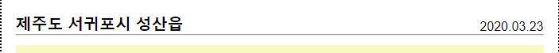

# 성산 일출봉 CSS


## 1. img태그는 inline, 밑에 여백 4px이 존재

- 해결 방법
  - display: block;
  - margin-bottom: -4px;
  - vertical align: bottom


## 2. block text 가운데 정렬

- 해결 방법
  - 패딩 넣기
  - line-height


## 3. body-title 글자 나누기

```css
.card-body-title {
    position: relative;
}
.card-body-title > h4 {
    display: inline-block;
}
.card-body-title > p {
    display: inline-block;
    position: absolute;
    right: 0px;
    bottom: 0px;
}
```

