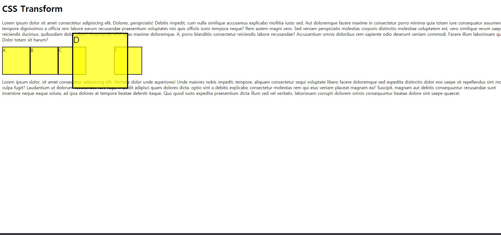

# Transform

- 기준점을 변경하여 변형시킬 수 있다.

- width와 height를 직접 변경하는 것은 다른 요소들이 방해를 받는다.
- transform은 다른 요소를 생각하지 않고 진행하기 때문에 연산량(?)이 준다.

```css
<style>
  .box-container {
    display: flex;
  }
  .box {
    width: 100px;
    height: 100px;
    background: rgba(255, 255, 0, 0.7);
    border: 2px solid black;
  }
  .box:hover {
    transform: scale(2);
  }
</style>
```


- D box에 마우스 올린 후 결과




## 기능

- scale : 본래 크기의 배수로 크기 증가
- rotate(deg) : degree 단위로 시계 방향으로 회전한다. -> rotate(45deg)
- skew(deg) : degree 단위로 비튼다.
  - skewX : x축을 기준으로 비튼다. (default)
  - skewY : y축을 기준으로 비튼다.
  - 각도를 음수로 하여 비틀 수 있다.
- translate : 이동
  - 축을 따로 지정할 수 있고, shorthand로 표현할 수 있다.
  - example
    - translate(30px, 10px)
    - translateY(10px)
    - translateX(30px)


## 기준점 변경

> transform의 기준점을 변경한다.


- **`transform-origin`**:
  - left top: 왼쪽 위
    - right bottom 등등..
  - x% y%: x축과 y축의 percentage로 기준점을 잡는다.
  - pixel로도 가능하다!

