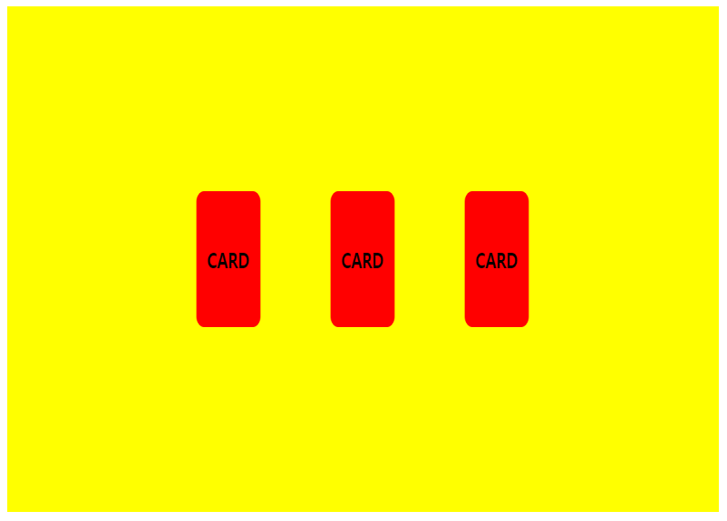

# CSS 3D

- element를 담고 있는 공간 (div 등)을 3차원 공간으로 만들어준다.
- 담고 있는 공간에 `perspective`를 준다.
  - perspective : 사람 눈에서 얼마나 멀어질 것인가..?
    - 가까운 경우가 더 역동적으로 변하는 기분
    - 왼쪽, 오른쪽 좌표에 따른 시점도 반영이 된다.
- element의 `transform`에 perspective를 주면 좌, 우 좌표에 따른 시점 반영을 없앨 수 있다.
  - `transform: perspective(500px) ...`

- mouse hover와 같은 이벤트로 처리할 때 기본적인 상황에서도 0도 회전과 같은 값을 넣어주는 것이 좋다.

- 3D X

- 3D

## 회전 시 뒷면을 넣어보자.

- div안에 두개의 div요소를 만든다 (앞면, 뒷면)
- transform-style: preserve-3d;
- backface-visibility: hidden;
- safari : -webkit-backface-...
  - 브라우저마다 접두어를 붙여야하는 경우가 있다.
  - 그럴 때는 접두어가 붙은 속성을 위에 모두 적고, 맨 아래에 기본속성을 넣어준다!